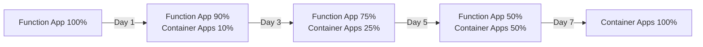

# Azure FastAPI 架構重構計畫

**日期**: 2025-07-28  
**版本**: 1.0  
**狀態**: 準備執行

## 📋 執行摘要

基於效能分析發現 Azure Functions 造成 3+ 秒固定開銷，決定將整個應用遷移到 Azure Container Apps。本文件說明 Git checkpoint 建立流程和架構重構的執行計畫。

---

## 一、當前狀態總結

### 1.1 效能問題
- **根本原因**: Azure Functions 架構不適合 API 服務
- **影響範圍**: 所有 6 個 API endpoints
- **效能損失**: 40-91%（依 API 類型而異）

### 1.2 解決方案
- **目標架構**: Azure Container Apps
- **預期改善**: 響應時間降低 40-90%
- **成本影響**: 月費從 $280 降至 $250

### 1.3 關鍵文件
- 效能分析報告: `performance_optimization/current/PERFORMANCE_ANALYSIS_REPORT_20250728.md`
- 架構提案: `performance_optimization/current/SIMPLIFIED_ARCHITECTURE_PROPOSAL_20250728.md`

---

## 二、Git Checkpoint 建立步驟

### 2.1 前置檢查

```bash
# 1. 檢查當前狀態
git status

# 2. 確認在正確的分支
git branch
# 應該在 main 或 staging

# 3. 查看未提交的變更
git diff
```

### 2.2 整理和提交當前變更

```bash
# 1. 添加效能優化相關文件
git add performance_optimization/
git add ARCHITECTURE_MIGRATION_PLAN.md

# 2. 添加其他已修改的文件（如果有）
git add -p  # 互動式添加，可以選擇性提交

# 3. 創建詳細的提交訊息
git commit -m "feat: Complete performance analysis and architecture proposal

- Discovered 3+ second overhead from Azure Functions architecture
- Analyzed all 6 API endpoints performance impact
- Created comprehensive architecture migration proposal
- Decision: Migrate to Azure Container Apps
- Expected improvement: 40-90% response time reduction
- Cost reduction: $280 -> $250/month

Key findings documented in:
- performance_optimization/current/PERFORMANCE_ANALYSIS_REPORT_20250728.md
- performance_optimization/current/SIMPLIFIED_ARCHITECTURE_PROPOSAL_20250728.md

This commit serves as checkpoint before architecture migration begins."
```

### 2.3 創建標籤（Tag）

```bash
# 1. 創建帶註解的標籤
git tag -a v1.0-pre-migration -m "Checkpoint before Container Apps migration

Current state:
- Azure Functions with Premium Plan EP1
- 6 API endpoints operational
- Average 3+ seconds overhead per request
- All tests passing

Next: Begin Container Apps migration"

# 2. 推送到遠端
git push origin main
git push origin v1.0-pre-migration
```

### 2.4 創建架構重構分支

```bash
# 1. 從當前狀態創建新分支
git checkout -b feature/container-apps-migration

# 2. 推送新分支到遠端
git push -u origin feature/container-apps-migration
```

---

## 三、架構重構執行計畫

### 3.1 第 1 週：準備階段

#### Day 1-2: 環境設置
```bash
# 1. 創建 Azure Container Registry
az acr create \
  --resource-group airesumeadvisorfastapi \
  --name airesumeadvisor \
  --sku Basic \
  --location japaneast

# 2. 創建 Container Apps 環境
az containerapp env create \
  --name airesumeadvisor-env \
  --resource-group airesumeadvisorfastapi \
  --location japaneast
```

#### Day 3-4: 應用容器化
- [ ] 創建 Dockerfile
- [ ] 調整應用配置
- [ ] 本地測試容器
- [ ] 推送到 Registry

#### Day 5: 初步部署
- [ ] 部署到 Container Apps（測試環境）
- [ ] 配置環境變數
- [ ] 健康檢查設置

### 3.2 第 2 週：功能驗證

#### 測試計畫
1. **功能測試**: 所有 6 個 API endpoints
2. **效能測試**: 驗證 3 秒開銷消除
3. **負載測試**: 100 QPS 目標
4. **安全掃描**: 容器漏洞檢查

#### 監控設置
- [ ] Application Insights 整合
- [ ] 自定義指標配置
- [ ] 警報規則設定

### 3.3 第 3 週：漸進式遷移



### 3.4 第 4 週：優化和清理

- [ ] 效能調優
- [ ] 成本優化
- [ ] 停用 Function App
- [ ] 文檔更新

---

## 四、風險管理

### 4.1 回滾計畫

```bash
# 如果需要回滾
git checkout v1.0-pre-migration
git checkout -b hotfix/emergency-rollback

# 使用 Traffic Manager 快速切回
az network traffic-manager endpoint update \
  --name container-apps-endpoint \
  --profile-name api-traffic-manager \
  --resource-group airesumeadvisorfastapi \
  --type azureEndpoints \
  --weight 0
```

### 4.2 風險緩解措施

| 風險 | 緩解措施 |
|------|---------|
| 資料遺失 | 確保 Redis 和 PostgreSQL 備份 |
| API 不相容 | 完整的 API 契約測試 |
| 效能未達預期 | 保留 Function App 30 天 |
| 成本超支 | 設定預算警報 |

---

## 五、成功標準

### 5.1 技術指標
- [ ] P95 響應時間 < 3 秒（當前 6-11 秒）
- [ ] 並發支援 > 20 QPS（當前 < 0.5 QPS）
- [ ] 錯誤率 < 0.1%
- [ ] 可用性 > 99.9%

### 5.2 業務指標
- [ ] 用戶滿意度提升
- [ ] API 調用成功率提升
- [ ] 成本控制在預算內

---

## 六、團隊分工

### 開發團隊
- **Claude Code**: 技術實施、程式碼修改
- **WenHao**: 專案管理、資源協調、最終審核

### 關鍵里程碑
- Week 1 結束: POC 完成
- Week 2 結束: 功能驗證通過
- Week 3 結束: 50% 流量遷移
- Week 4 結束: 完全遷移

---

## 七、檢查清單

### 遷移前檢查
- [ ] 所有程式碼已提交
- [ ] 創建 v1.0-pre-migration 標籤
- [ ] 備份資料庫
- [ ] 記錄當前效能基準
- [ ] 通知相關團隊

### 遷移後驗證
- [ ] 所有 API 功能正常
- [ ] 效能達到預期
- [ ] 監控正常運作
- [ ] 成本在控制範圍
- [ ] 文檔已更新

---

## 八、相關資源

### 文檔連結
- [Container Apps 文檔](https://docs.microsoft.com/azure/container-apps/)
- [FastAPI 容器化指南](https://fastapi.tiangolo.com/deployment/docker/)

### 監控儀表板
- Application Insights: [Link]
- Azure Monitor: [Link]
- Cost Management: [Link]

---

**下一步行動**:
1. 執行 Git checkpoint 命令
2. 創建 feature 分支
3. 開始第 1 週的環境設置

**預計完成日期**: 2025-08-25（4 週後）