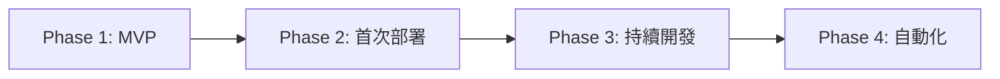
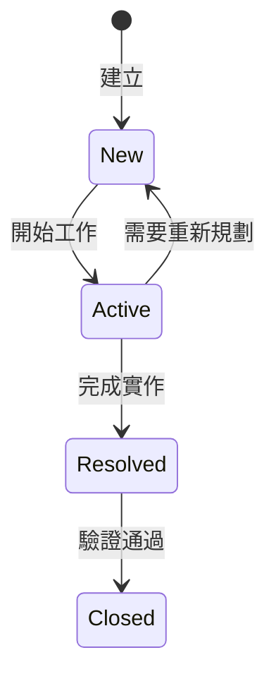
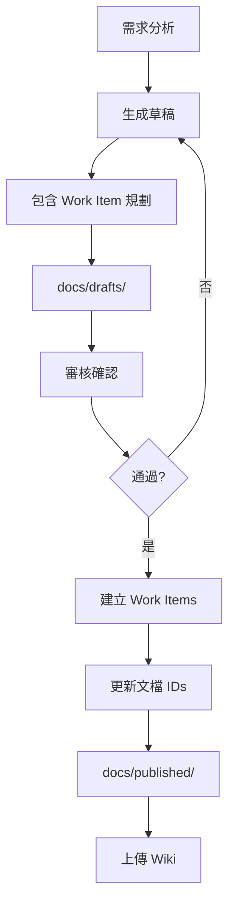

# CLAUDE.md - FHS + FastAPI 重構專案協作指南 v2.0

本文件為 Claude Code + Cursor + Azure DevOps 協作開發指南，專門為 API 重構專案（FHS + FastAPI）設計。

## 📋 目錄

1. [專案概述](#專案概述)
2. [安全配置指南](#安全配置指南)
3. [協作角色與職責](#協作角色與職責)
4. [開發階段與里程碑](#開發階段與里程碑)
5. [Work Items 統一管理](#work-items-統一管理)
6. [文檔工作流程](#文檔工作流程)
7. [協作記錄指南](#協作記錄指南)
8. [測試策略與管理](#測試策略與管理)
9. [Azure CLI 命令參考](#azure-cli-命令參考)
10. [快速參考卡](#快速參考卡)
11. [Bubble.io API 相容性](#bubbleio-api-相容性)
12. [注意事項](#注意事項)

---

## 專案概述

### 技術棧
- **架構模式**: FHS (Functional Hierarchy Structure)
- **框架**: FastAPI
- **Python 版本**: 3.10+ (建議使用 3.11)
- **部署平台**: Azure Function App
- **版本控制**: GitHub (主要) + Azure DevOps Repos (鏡像)
- **CI/CD**: ✅ GitHub Actions → Azure Functions（已完成設置，push to main 自動部署）
- **協作工具**: Claude Code + Cursor + Azure DevOps + Serena MCP

### Azure DevOps 專案資訊
- **組織**: airesumeadvisor
- **專案**: API
- **URL**: https://dev.azure.com/airesumeadvisor/API

### Azure 資源資訊
- **Subscription ID**: 5396d388-8261-464e-8ee4-112770674fba
- **Resource Group**: airesumeadvisorfastapi
- **Application Insights**: airesumeadvisorfastapi
- **Tenant**: wenhaoairesumeadvisor.onmicrosoft.com
- **Portal URL**: https://portal.azure.com/#@wenhaoairesumeadvisor.onmicrosoft.com/resource/subscriptions/5396d388-8261-464e-8ee4-112770674fba/resourceGroups/airesumeadvisorfastapi/providers/Microsoft.Insights/components/airesumeadvisorfastapi/overview

### Azure Function App 資訊
- **Function App 名稱**: airesumeadvisor-fastapi
- **基礎 URL**: https://airesumeadvisor-fastapi.azurewebsites.net
- **Host Keys**: 請勿提交到版本控制！存放在：
  - Azure Portal → Function App → Function Keys
  - 本地環境變數或 `.env` 檔案（已加入 .gitignore）
  - Azure Key Vault（生產環境）
- **API URL 格式**:
  ```
  https://airesumeadvisor-fastapi.azurewebsites.net/api/v1/[endpoint]?code=[YOUR_HOST_KEY]
  ```

### FHS + FastAPI 架構規範

```
api_project/
├── CLAUDE.md                    # 本協作指南
├── .cursor/                     # Cursor IDE 配置
├── .serena/                     # Serena MCP 記憶系統
├── legacy/                      # 舊版參考資料
├── temp/                        # 臨時檔案統一管理
│   ├── tests/                  # 測試相關臨時檔案
│   ├── demos/                  # 展示檔案
│   └── dev/                    # 開發暫存檔案
├── docs/                        # 文檔管理
│   ├── drafts/                 # 草稿文檔
│   ├── published/              # 已發布文檔
│   ├── work_items/             # Work Item 記錄
│   └── local/                  # 本地文檔
├── src/                         # FHS 架構原始碼
├── tests/                       # 測試檔案
├── azure/                       # Azure 部署相關
└── .github/                     # CI/CD 配置
```

---

## 安全配置指南

### 環境變數管理

```yaml
# 公開配置（可提交）
EMBEDDING_ENDPOINT: https://wenha-m7qan2zj-swedencentral.cognitiveservices.azure.com/...
LLM2_ENDPOINT: https://wenha-m7qan2zj-swedencentral.cognitiveservices.azure.com

# 敏感配置（絕不提交）- 存放位置：
# 1. Azure Key Vault (生產環境)
# 2. local.settings.json (本地開發)
# 3. GitHub Secrets (CI/CD)
# 4. Azure Function App Configuration (部署環境)
```

### 配置範例

```python
# src/core/config.py
from pydantic_settings import BaseSettings
from azure.keyvault.secrets import SecretClient
from azure.identity import DefaultAzureCredential

class Settings(BaseSettings):
    # 公開配置
    embedding_endpoint: str = "https://..."
    llm2_endpoint: str = "https://..."
    
    # 敏感配置 - 從環境變數或 Key Vault 讀取
    llm2_api_key: str = ""
    openai_api_key: str = ""
    
    def load_from_keyvault(self):
        """生產環境從 Key Vault 載入敏感資訊"""
        keyvault_url = "https://your-keyvault.vault.azure.net"
        credential = DefaultAzureCredential()
        client = SecretClient(vault_url=keyvault_url, credential=credential)
        
        self.llm2_api_key = client.get_secret("LLM2-API-KEY").value
        self.openai_api_key = client.get_secret("OPENAI-API-KEY").value
```

### 安全檢查清單
- [ ] 確保 .gitignore 包含所有敏感檔案
- [ ] API Keys 存放在環境變數或 Key Vault
- [ ] local.settings.json 不提交到版本控制
- [ ] 使用 Managed Identity 存取 Azure 資源

---

## 協作角色與職責

### 責任分配矩陣 (RACI)

| 任務 | Claude | Cursor | WenHao |
|------|--------|--------|--------|
| 需求分析 | R | C | A |
| 架構設計 | R | C | A |
| 文檔撰寫 | R | I | A |
| Work Item 建立 | R | I | A |
| 程式碼實作 | C | R | A |
| 單元測試 | C | R | A |
| 整合測試 | R | R | A |
| 部署執行 | C | C | R |
| 文檔上傳 | I | I | R |

*R=負責執行, A=最終負責, C=需諮詢, I=需通知*

### 各角色職責說明

**🤖 Claude Code**
- 高層次規劃、架構設計、風險評估
- 生成需求、測試、設計、部署文檔
- Work Items 規劃與建立
- 測試案例設計

**💻 Cursor**
- 程式碼實作與單元測試
- 確保符合 FHS + FastAPI 最佳實踐
- 執行整合測試

**👤 WenHao**
- 審核確認文檔和規劃
- 執行部署與環境配置
- 同步文檔到 DevOps Wiki

---

## 開發階段與里程碑

### 開發流程概覽



### Phase 1: MVP 開發（Week 1-3）
**目標**: 完成核心功能的本地開發
- [ ] 分析原始 API，識別核心模組
- [ ] 設計 FHS 架構
- [ ] 實作基本功能
- [ ] 本地測試通過
- [ ] API 文檔完成

### Phase 2: 首次部署（Week 4）
**目標**: 手動部署到 Azure
- [ ] 準備部署環境
- [ ] 配置環境變數
- [ ] 執行手動部署
- [ ] 線上測試與問題修復
- [ ] 記錄部署步驟

### Phase 3: 持續開發（Week 5-6）
**目標**: 基於部署經驗優化
- [ ] 開發更多模組
- [ ] 優化架構
- [ ] 整合測試
- [ ] 準備自動化

### Phase 4: 自動化與優化（已完成）
**狀態**: ✅ 已完成
- [x] 設置 GitHub Actions
- [x] 自動化測試
- [x] 自動化部署（push to main → Azure）
- [x] 監控優化

### 階段檢查點

**MVP 完成標準**
- 核心 API 模組完成
- 本地測試通過
- 基本錯誤處理
- API 文檔自動生成

**部署完成標準**
- Azure Function App 運行正常
- 環境變數正確配置
- 監控設置完成
- 成本在預算內

---

## Work Items 統一管理

### Work Item 類型與負責人

| 類型 | 預設負責人 | Azure DevOps 使用者 | 職責 |
|------|------------|-------------------|------|
| Epic | Claude | claude@airesumeadvisor.com | 高層次規劃 |
| Feature | Claude | claude@airesumeadvisor.com | 功能設計 |
| User Story | Cursor | cursor@airesumeadvisor.com | 實作細節 |
| Task | 依性質 | 見下方 | 具體執行 |
| Test Case | Claude/Cursor | 見下方 | 測試設計/執行 |
| Bug | 依類型 | 見下方 | 問題解決 |

**Task 負責人分配**
- 程式碼實作 → cursor@airesumeadvisor.com
- 環境設定 → wenhao@airesumeadvisor.com
- 部署配置 → wenhao@airesumeadvisor.com
- 文檔撰寫 → claude@airesumeadvisor.com

### Work Item 狀態流程



### 狀態管理最佳實踐
1. **即時更新**: 開始工作時立即更新為 Active
2. **單一負責**: 同時只有一個 Work Item 處於 Active
3. **完成即報**: 完成後立即更新狀態
4. **驗收確認**: Resolved → Closed 需要明確驗收

---

## 文檔工作流程

### 文檔生命週期



### 文檔分類
- **drafts/**: 待審核文檔（含 [PENDING_XXX_ID] 佔位符）
- **published/**: 已發布文檔（含實際 Work Item URLs）
- **work_items/**: Work Item 建立記錄
- **local/**: 本地文檔（不上傳）

### 文檔命名規範
```yaml
需求文檔: REQ_[模組]_[YYYYMMDD].md
測試文檔: TEST_[模組]_[YYYYMMDD].md
設計文檔: DESIGN_[模組]_[YYYYMMDD].md
部署文檔: DEPLOY_[模組]_[YYYYMMDD].md
API文檔: API_[模組]_[版本].md
Work Item: WI_[模組]_[YYYYMMDD].json
```

---

## 協作記錄指南

### 記錄格式 (5W1H)
```markdown
### [HH:MM] [工具] - [動作]
Who: [Cursor/Claude Code/用戶]
What: [做了什麼]
Why: [為什麼做]
When: [台灣時間]
How: [怎麼做的]
```

### 必須記錄的操作
- 代碼修改
- 配置變更
- 測試執行
- 部署操作
- 文檔更新
- 技術決策

### Cursor 任務分派
當 Claude 分派任務時：
1. 詳細規格記錄在 COLLABORATION_LOG.md
2. 給用戶簡短提示：
```
請查看 COLLABORATION_LOG.md 中的任務指派：
📍 位置：第 XXX-XXX 行
⏰ 時間：[HH:MM] 
📋 任務：[簡述]
```

---

## 測試策略與管理

### 測試層級
- **單元測試**: 覆蓋率 > 80%
- **整合測試**: 涵蓋關鍵路徑  
- **Security Tests**: 使用安全標記，順序執行（避免 LLM API 速率限制）
- **API 文檔測試**: 驗證 OpenAPI schema 正確性
- **效能測試**: 一致性和回應時間驗證

### KPI 測試標準
```yaml
一致性測試:
  測試次數: 50次
  目標:
    短文本: ≥70% 一致率
    長文本: ≥50% 一致率
    兩次相同: ≥35%
```

### 測試資料規範
```yaml
測試文本要求:
  job_description:
    最小長度: 200字元
    最大長度: 5000字元  # Bubble.io 前端限制
    保證: 前端已確保非空值
  
  resume:
    最小長度: 200字元  
    最大長度: 5000字元  # Bubble.io 前端限制
    保證: 前端已確保非空值
  
  測試重點:
    - 正常案例 (200-1000字)
    - 邊界案例 (接近5000字)
    - 特殊字元 (emoji、多語言)
    - 不需測試: None、空字串、超長文本
  
範例:
  # 正常測試案例
```

### 邊界測試設計原則

在設計邊界測試（Boundary Testing）時，必須先與 WenHao 討論以收斂程式碼複雜度：

1. **了解業務約束**
   ```yaml
   # 範例：前端已實施的約束
   job_description:
     min_length: 200      # Bubble.io 前端保證
     max_length: 5000     # Bubble.io 前端限制
     nullable: false      # 前端確保非空
   
   # 測試設計應反映這些約束
   boundary_tests:
     - 199 chars         # 低於最小值
     - 200 chars         # 剛好最小值
     - 5000 chars        # 剛好最大值
     - 5001 chars        # 略超最大值
     # 不需要測試 None/空字串（前端已防止）
   ```

2. **避免不必要的測試組合**
   ```python
   # ❌ 錯誤：測試所有理論上可能的情況
   test_cases = [
       None, "", " ", "a", "ab", "abc", ... "a"*10000
   ]
   
   # ✅ 正確：只測試實際業務場景
   test_cases = [
       "a" * 199,    # 接近最小邊界
       "a" * 200,    # 最小邊界
       "a" * 5000,   # 最大邊界
       "a" * 5001,   # 超出邊界
   ]
   ```

3. **討論時機**
   - 設計新的邊界測試前
   - 發現測試案例過多時
   - 不確定業務規則時

### 安全測試設計原則

1. **驗證防護而非攻擊**
   ```python
   # ❌ 錯誤：使用真實惡意程式碼
   payload = "'; DROP TABLE users; --"  # 可能觸發 IP 封鎖
   
   # ✅ 正確：使用安全測試標記
   payload = "SAFE_SQL_TEST_DROP_KEYWORD"  # 不會觸發封鎖
   ```

2. **測試數據管理**
   ```yaml
   安全測試標記:
     SQL注入: SAFE_SQL_TEST_[類型]
     XSS攻擊: SAFE_XSS_TEST_[類型]
     路徑遍歷: SAFE_PATH_TEST_[類型]
   ```

3. **測試環境隔離**
   - 使用測試專用 headers（X-Test-Bypass-Security）
   - 每個測試前清理安全封鎖狀態
   - 避免測試間相互影響

### 避免測試相互影響的實作方法

1. **使用 Fixture 自動清理**
   ```python
   # conftest.py
   @pytest.fixture(autouse=True)
   def clean_test_environment():
       """每個測試前後自動清理"""
       # 測試前：清理任何殘留狀態
       from src.core.monitoring.security_monitor import security_monitor
       security_monitor.clear_all_blocks()
       
       yield  # 執行測試
       
       # 測試後：再次清理
       security_monitor.clear_all_blocks()
   ```

2. **獨立的測試數據**
   ```python
   # ❌ 錯誤：共用測試數據
   TEST_USER = {"id": 1, "name": "test"}
   
   def test_1():
       TEST_USER["status"] = "active"  # 修改共用數據！
   
   def test_2():
       # TEST_USER 已被 test_1 修改！
       assert TEST_USER.get("status") is None  # 失敗！
   
   # ✅ 正確：每個測試用獨立數據
   def test_1():
       user = {"id": 1, "name": "test"}
       user["status"] = "active"
   
   def test_2():
       user = {"id": 1, "name": "test"}  # 全新的數據
       assert user.get("status") is None  # 成功！
   ```

3. **測試隔離檢查清單**
   - [ ] 不修改全域變數
   - [ ] 不依賴測試執行順序
   - [ ] 清理所有建立的資源
   - [ ] 重置所有修改的設定
   - [ ] 使用獨立的測試數據

### 測試設計的額外最佳實踐

1. **明確的錯誤訊息**
   ```python
   # ❌ 錯誤：不明確的斷言
   assert response.status_code == 200
   
   # ✅ 正確：提供上下文資訊
   assert response.status_code == 200, \
       f"Expected 200 but got {response.status_code}. " \
       f"Response: {response.text[:500]}"
   ```

2. **測試資料的可讀性**
   ```python
   # ❌ 錯誤：無意義的測試資料
   test_jd = "a" * 200
   
   # ✅ 正確：接近真實但明確是測試
   test_jd = """
   [TEST DATA] Software Engineer Position
   We are looking for a talented engineer with experience in:
   - Python development (3+ years)
   - FastAPI framework
   - Cloud deployment (Azure preferred)
   This is test data for boundary validation.
   """ + " Additional requirements." * 10  # 補充到需要的長度
   ```

3. **測試失敗時的除錯資訊**
   ```python
   # 在測試失敗時自動輸出有用資訊
   @pytest.fixture
   def client_with_logging():
       client = TestClient(app)
       
       # 攔截所有請求
       original_request = client.request
       def logged_request(method, url, **kwargs):
           response = original_request(method, url, **kwargs)
           
           # 失敗時輸出詳細資訊
           if response.status_code >= 400:
               print(f"\n=== Request Failed ===")
               print(f"Method: {method} {url}")
               print(f"Headers: {kwargs.get('headers', {})}")
               print(f"Body: {kwargs.get('json', kwargs.get('data'))}")
               print(f"Response: {response.status_code}")
               print(f"Content: {response.text[:1000]}")
               
           return response
       
       client.request = logged_request
       return client
   ```

4. **效能考量的平衡**
   ```python
   # ❌ 錯誤：過度測試
   @pytest.mark.parametrize("size", range(1, 10000))  # 10000個測試！
   def test_all_sizes(size):
       pass
   
   # ✅ 正確：選擇關鍵測試點
   @pytest.mark.parametrize("size,expected", [
       (199, 422),      # 低於最小值
       (200, 200),      # 最小邊界
       (1000, 200),     # 正常值
       (5000, 200),     # 最大邊界
       (5001, 422),     # 超過最大值
   ])
   def test_key_boundaries(size, expected):
       pass
   ```

5. **測試的可維護性**
   ```python
   # 將測試常數集中管理
   class TestConstants:
       # API 限制
       MIN_TEXT_LENGTH = 200
       MAX_TEXT_LENGTH = 5000
       
       # 測試資料模板
       JD_TEMPLATE = """
       [TEST] {role} Position at {company}
       Requirements: {requirements}
       """
       
       # 預期錯誤訊息
       ERROR_TOO_SHORT = "Text must be at least 200 characters"
       ERROR_TOO_LONG = "Text exceeds 5000 character limit"
   ```

6. **非同步測試的陷阱**
   ```python
   # ❌ 錯誤：忘記 await
   @pytest.mark.asyncio
   async def test_async_endpoint():
       response = client.post("/async-endpoint")  # 忘記 await！
   
   # ✅ 正確：正確處理非同步
   @pytest.mark.asyncio
   async def test_async_endpoint():
       async with httpx.AsyncClient() as client:
           response = await client.post("/async-endpoint")
   ```

7. **測試覆蓋率的智慧**
   ```yaml
   覆蓋率目標:
     核心業務邏輯: 90%+
     API 端點: 100%
     錯誤處理: 80%+
     工具函數: 70%+
     
   不需要測試:
     - 第三方庫的功能
     - 簡單的 getter/setter
     - 框架自動生成的代碼
   ```

8. **測試命名規範**
   ```python
   # 測試命名：test_[被測功能]_[測試場景]_[預期結果]
   
   def test_keyword_extraction_valid_input_returns_keywords():
       """測試關鍵字提取在有效輸入時返回關鍵字"""
       pass
   
   def test_keyword_extraction_empty_jd_returns_422():
       """測試關鍵字提取在空JD時返回422錯誤"""
       pass
   ```

9. **測試文檔化**
   ```python
   class TestKeywordExtraction:
       """
       關鍵字提取 API 測試套件
       
       測試範圍：
       - 正常輸入處理
       - 邊界值驗證
       - 錯誤處理
       - 安全防護
       
       前置條件：
       - API 服務運行在 localhost:8000
       - 測試數據符合業務規則（200-5000字元）
       
       已知限制：
       - 不測試 None 值（前端保證非空）
       - 不測試超長文本（前端限制5000）
       """
   ```

10. **回歸測試的重要性**
    ```python
    # 當修復bug時，立即加入回歸測試
    def test_regression_empty_keywords_array():
        """
        回歸測試：確保空關鍵字陣列不會導致崩潰
        Issue: #123 - API返回空陣列時前端崩潰
        Fixed: 2024-07-14
        """
        response = client.post("/api/v1/extract-jd-keywords", 
                             json={"job_description": "Short text"})
        
        # 確保即使沒有關鍵字也有正確結構
        assert response.json()["data"]["keywords"] == []
        assert isinstance(response.json()["data"]["keywords"], list)
    ```

### API 文檔測試設計原則

1. **區分端點類型**
   ```python
   # 業務端點 vs 資訊端點
   BUSINESS_ENDPOINTS = ["/extract-jd-keywords", "/tailor-resume"]
   INFO_ENDPOINTS = ["/health", "/version", "/status"]
   
   # 不同類型有不同的測試要求
   if endpoint in BUSINESS_ENDPOINTS:
       assert has_error_responses(endpoint)
       assert has_request_validation(endpoint)
   ```

2. **漸進式品質標準**
   ```yaml
   文檔品質階段:
     MVP:
       example_coverage: 10%
       error_responses: 僅業務端點
       descriptions: 基本描述
     
     v1.0:
       example_coverage: 30%
       error_responses: 所有端點
       descriptions: 詳細描述
     
     v2.0:
       example_coverage: 50%
       error_responses: 詳細錯誤碼
       descriptions: 多語言支援
   ```

3. **實用的測試工具**
   ```bash
   # 檢查 API 文檔完整性
   make check-api-docs
   
   # 生成缺失的文檔報告
   python tools/api_doc_analyzer.py --report missing
   
   # 驗證實際響應符合文檔
   python tools/contract_test.py
   ```

4. **Async 測試最佳實踐**
   ```python
   # 使用 httpx.AsyncClient 而非混用 sync/async
   async with httpx.AsyncClient() as client:
       response = await client.get("/openapi.json")
   
   # 避免不必要的 async fixture
   # 簡單的數據獲取用同步即可
   ```
  job_description: |
    We are looking for an experienced Software Engineer to join our dynamic team.
    The ideal candidate will have strong programming skills in Python and JavaScript,
    extensive experience with cloud technologies including AWS and Azure,
    and excellent problem-solving abilities. You will be working on cutting-edge
    projects in a collaborative environment with opportunities for growth.
    Minimum 5 years of experience required.
    
  # 邊界測試案例  
  job_description: "合理的長文本" * 100  # 約 500 字，不需要測試 5000+ 字
```

### 測試修復流程
```markdown
### [時間] 測試修復進度
**問題**: [描述]
**根因**: [分析]
**修復**: [方案]
**狀態**: 
- HH:MM - 發現問題
- HH:MM - 實施修復
- HH:MM - 驗證通過
```

---

## Azure CLI 命令參考

### 初始設置
```bash
az login
az account set --subscription "5396d388-8261-464e-8ee4-112770674fba"
az configure --defaults group=airesumeadvisorfastapi
az devops configure --defaults organization=https://dev.azure.com/airesumeadvisor project=API
```

### Work Item 管理
```bash
# 建立 Work Item
az boards work-item create \
  --title "[標題]" \
  --type [類型] \
  --project API \
  --assigned-to "[email]"

# 更新狀態
az boards work-item update --id [ID] --state [狀態]

# 查詢 Work Items
az boards query --wiql "[查詢語句]"
```

### Application Insights 查詢
```bash
# 查詢最近的 customEvents
az monitor app-insights query \
  --app airesumeadvisorfastapi \
  --analytics-query "customEvents | take 10"

# 查詢不支援語言的 JD preview
az monitor app-insights query \
  --app airesumeadvisorfastapi \
  --analytics-query "customEvents | where name == 'UnsupportedLanguageSkipped' | project timestamp, customDimensions.detected_language, customDimensions.jd_preview | take 5"

# 查詢 API 效能指標
az monitor app-insights query \
  --app airesumeadvisorfastapi \
  --analytics-query "customEvents | where name == 'RequestTracked' | summarize avg(todouble(customDimensions.duration_ms)) by tostring(customDimensions.endpoint)"
```

### 常用查詢
```bash
# 進行中項目
"SELECT [System.Id], [System.Title] FROM workitems WHERE [System.State] = 'Active'"

# 本週變更
"SELECT * FROM workitems WHERE [System.ChangedDate] >= @Today-7"
```

---

## 快速參考卡

### 日常開發命令
```bash
# 本地測試
pytest tests/unit/
uvicorn src.main:app --reload

# 測試 Azure Function App
curl -X POST "https://airesumeadvisor-fastapi.azurewebsites.net/api/v1/extract-jd-keywords?code=[YOUR_HOST_KEY]" \
  -H "Content-Type: application/json" \
  -d '{"job_description": "Python developer needed", "language": "en"}'

# Git 提交（含 Work Item）
git commit -m "AB#[ID] [說明]"

# 記錄進度
claude "將今日開發成果記錄到 Serena"
```

### 文檔管理命令
```bash
# 生成文檔
claude "為 [模組] 生成需求文檔"

# 建立 Work Items
claude "建立文檔中的 Work Items"

# 檢查待同步
claude "列出待上傳的文檔"
```

### 部署相關命令
```bash
# 環境檢查
python --version

# 部署準備
claude "生成部署檢查清單"

# 配置環境
az functionapp config appsettings set ...
```

---

## Bubble.io API 相容性

### 關鍵約束
- **絕對禁止** 使用 `Optional[Type]` 欄位
- **必須確保** 所有欄位始終存在
- **失敗情況** 回傳空值而非 `null`
- **HTTP 200** 必須使用相同 JSON 結構

### 正確範例
```python
class ApiResponse(BaseModel):
    success: bool
    data: DataModel              # 總是存在
    error: ErrorModel           # 固定結構
    
class DataModel(BaseModel):
    results: List[str] = []     # 失敗時空陣列
    count: int = 0              # 失敗時為 0
    message: str = ""           # 失敗時空字串
```

### Bubble.io + TinyMCE 整合注意事項

**重要**：在 Bubble.io 使用 TinyMCE Rich Text Editor 時，CSS 樣式必須透過 JavaScript 動態注入！

1. **方法**：使用 "When page is loaded" workflow 執行 JavaScript
2. **原因**：Bubble 平台限制，無法直接設置 TinyMCE 內部樣式
3. **實作**：
   ```javascript
   function injectTinyMCEStyles() {
       if (typeof tinymce !== 'undefined' && tinymce.activeEditor) {
           var editor = tinymce.activeEditor;
           editor.dom.addStyle('/* CSS 內容 */');
       }
   }
   ```
4. **除錯**：檢查是否有多個 CSS 來源造成衝突（page header vs page loaded）

詳細說明：`.serena/memories/technical_decisions/bubble_tinymce_css_injection.md`

---

## 注意事項

### 重要提醒
1. 敏感資訊絕不提交到版本控制
2. 使用 Azure CLI 存取 DevOps（無需 PAT token）
3. 建立 Work Item 時指定正確的 Owner
4. ✅ CI/CD 已完成設置，push to main 自動部署到 Azure
5. 確保 Python 3.10+ 避免相容性問題
6. 注意 Azure 成本監控
7. **Git 提交規則**：專案已完成 CI/CD 設置（push to main 自動部署到 Azure），Claude Code **絕對不可以**自行執行 `git commit`。任何提交前必須：
   - 執行預提交測試：`./run_precommit_tests.sh`
   - 向用戶展示完整測試結果
   - 確保所有測試通過（包括代碼風格檢查）
   - 詳細說明要提交的內容
   - 獲得用戶明確同意後才能執行
   - 提交訊息需包含清晰的變更說明
8. **時間處理規則**：任何需要使用日期或時間的場合（如文檔命名、日誌記錄、時間戳等），必須：
   - 先使用 Bash 工具執行 `TZ='Asia/Taipei' date '+%Y-%m-%d %H:%M:%S %Z'` 獲取準確的台灣時間
   - 文檔命名使用格式：`[TYPE]_[MODULE]_YYYYMMDD.md`（例：`TEST_GAP_ANALYSIS_20250711.md`）
   - 日誌記錄使用格式：`YYYY-MM-DD HH:MM:SS CST`
   - 絕不使用 <env> 中的日期或憑空推測日期
9. **LLM Prompt 修改規則**：
   - **僅修改 Prompt 檔案**：可使用 `--no-api` 快速測試
   - **Prompt 位置**：`src/prompts/[task]/v[X.Y.Z]-[language].yaml`
   - **程式碼修改情況**：
     - 新版本建立 → 無需修改程式碼
     - 改變默認版本 → 修改 `default_prompt_version`
     - 新增 prompt 參數 → 修改服務層
     - 回應格式變更 → 修改 response model

### 環境變數問題解決方案

#### 問題：EMBEDDING_API_KEY environment variable is required

**根本原因**：
1. `embedding_client.py` 使用 `os.getenv()` 直接讀取環境變數
2. `main.py` 沒有載入 `.env` 檔案
3. pydantic_settings 只對 Settings 類別有效，不影響 `os.getenv()`

**解決方案**：

1. **本地開發** - 在啟動前載入 .env：
   ```bash
   # 方法 1: 使用 python-dotenv
   python -c "from dotenv import load_dotenv; load_dotenv()" && uvicorn src.main:app --reload
   
   # 方法 2: 設置環境變數
   export EMBEDDING_API_KEY="your-api-key"
   uvicorn src.main:app --reload
   
   # 方法 3: 在 main.py 添加 (推薦)
   from dotenv import load_dotenv
   load_dotenv()  # 在 import 後立即載入
   ```

2. **生產環境** - Azure Function App 配置：
   ```bash
   az functionapp config appsettings set \
     --name airesumeadvisorfastapi \
     --resource-group airesumeadvisorfastapi \
     --settings EMBEDDING_API_KEY="your-api-key"
   ```

3. **統一解決方案** - 修改 embedding_client.py 使用 settings：
   ```python
   # 改為從 settings 讀取
   from src.core.config import get_settings
   
   def get_azure_embedding_client():
       settings = get_settings()
       return AzureEmbeddingClient(
           endpoint=settings.embedding_endpoint,
           api_key=settings.embedding_api_key
       )
   ```

**建議**：使用方法 3，確保所有環境變數都通過統一的 Settings 管理。

### Code Style 自動檢查規則 (重要！)

在每次完成程式碼修改後，Claude Code **必須**執行 code style 檢查：

```bash
# 執行 code style 檢查
ruff check src/ tests/ --exclude=legacy,archive
```

如果發現任何 style 問題：
1. **立即使用 --fix 自動修復**：
   ```bash
   ruff check src/ tests/ --exclude=legacy,archive --fix
   ```

2. **常見的 ruff 錯誤類型**：
   - `I001`: Import 排序問題 → 自動修復
   - `F401`: 未使用的 import → 自動修復
   - `UP035`: 過時的 typing 語法 → 自動修復
   - `UP006`: 使用舊式 type annotation → 自動修復
   - `SIM`: 簡化程式碼建議 → 部分可自動修復

3. **在提交程式碼前，確保看到**：
   ```
   All checks passed!
   ```

4. **Claude Code 工作流程**：
   ```
   編寫/修改程式碼
   ↓
   執行 ruff check
   ↓
   如有錯誤 → ruff check --fix
   ↓
   確認 "All checks passed!"
   ↓
   才告知使用者完成
   ```

這樣可以避免使用者在執行 precommit tests 時才發現 style 問題！

### 預提交測試流程

#### 快速決策規則

**使用 `--no-api` 快速測試**：
- 文檔檔案 (`*.md`, `docs/*`)  
- 配置檔案 (`.gitignore`, `*.json` 配置)
- 測試檔案修改 (`tests/*`)
- 工具腳本 (`tools/*`, `*.sh`)
- **LLM Prompt 檔案** (`src/prompts/**/*.yaml`) - prompt 調整不影響程式邏輯

**使用完整測試**：
- 任何 `src/` 目錄的 `.py` 檔案（除了 `src/prompts/`）
- 關鍵配置 (`config.py`, `requirements.txt`)  
- 部署相關 (`main.py`, `azure-functions/`)
- 最終提交前（無論修改什麼）

#### 執行命令

```bash
# 完整測試（修改程式碼）
./run_precommit_tests.sh --parallel

# 快速測試（文檔/配置）  
./run_precommit_tests.sh --no-api
```

#### 測試要求

**涵蓋範圍**: 單元測試、整合測試、性能測試、Bubble.io 相容性、代碼風格 (ruff)

**通過標準**: 所有測試 Passed、Failed: 0、代碼風格檢查通過

### 代碼風格規範（ruff）

**核心規則**: SIM (簡化)、F (未使用變數)、E (行長度88字元)、I (import排序)、UP (現代語法)

**編碼實踐**: 使用現代 Python 語法、保持 import 整潔、適當換行

### 檔案管理

#### 臨時檔案建立規則 (重要！)

**Claude Code 建立臨時檔案時必須遵循以下規則：**

```yaml
測試腳本:     temp/tests/scripts/test_[功能]_[日期].py
測試日誌:     temp/tests/logs/[功能]_test_[日期].log  
測試結果:     temp/tests/results/[功能]_results_[日期].json
Demo檔案:     temp/demos/html/[功能]_demo_[日期].html
Shell腳本:    temp/dev/scripts/[功能]_[用途].sh
實驗代碼:     temp/dev/experiments/[實驗名稱].py
草稿文檔:     temp/dev/drafts/[主題]_draft.md
```

**命名約定**:
- 日期格式: YYYYMMDD (例：20250714)
- 功能描述: 使用底線分隔 (gap_analysis, api_performance)  
- 包含用途說明: test, debug, demo, experiment

**範例**:
```python
# temp/tests/scripts/test_gap_analysis_retry_20250714.py
"""
測試 Gap Analysis 重試機制
建立: 2025-07-14, 用途: 驗證重試邏輯
"""
```

#### 正式檔案結構
- **正式測試**: `tests/unit/`, `tests/integration/`
- **專案文檔**: `docs/published/`, `docs/drafts/`  
- **記憶系統**: `.serena/memories/` (API分析、開發進度、架構決策)

### LLM 呼叫最佳實踐

**核心保護機制**:
- **空白內容檢測** + **重試機制** (3次，指數退避)  
- **預設訊息回傳** + **完整日誌記錄**
- **監控與追蹤** (duration, retry_count, success率)

**實作範例**: `src/services/gap_analysis.py`

**詳細指南**: `docs/published/TEST_BEST_PRACTICES_20250714.md`

### API 測試最佳實踐

**基本原則**: 記錄完整請求/回應內容便於 debug

**必須包含**:
- 完整請求/回應記錄
- 每個欄位實際值統計  
- 失敗時詳細資訊
- 個別回應檔案保存
- 無緩衝輸出 (`flush=True`)

**詳細範例與完整腳本**: `docs/published/TEST_BEST_PRACTICES_20250714.md`

---

## Azure Monitor Workbook 格式注意事項

### Workbook JSON 格式要求

在建立或編輯 Azure Monitor Workbook 時，使用 Advanced Editor 需要注意以下 JSON 格式要求：

1. **查詢字串格式**：
   - `query` 欄位的值必須是**單行字串**（不能有換行符號）
   - 所有 KQL 查詢語句必須在同一行，使用空格分隔不同的子句
   - 範例：
     ```json
     "query": "customEvents | where timestamp {TimeRange} | where name == \"RequestTracked\" | summarize count() by endpoint"
     ```

2. **字串中的引號處理**：
   - 在查詢字串中的引號必須使用反斜線逃脫：`\"`
   - 正確：`"query": "customEvents | where name == \"RequestTracked\""`
   - 錯誤：`"query": "customEvents | where name == "RequestTracked""`

3. **物件格式一致性**：
   - 保持 JSON 物件的格式一致
   - 陣列元素格式：`{"durationMs": 300000}` 而非 `{"durationMs":300000}`

4. **常見錯誤訊息**：
   - `Bad control character in string literal in JSON` - 通常是因為查詢字串中有換行符號
   - 解決方法：將多行查詢合併為單行，使用管道符號 `|` 和空格分隔

### 最佳實踐

1. **先在 Query Explorer 測試**：
   - 在 Application Insights 的 Logs 介面測試 KQL 查詢
   - 確認查詢正確後，再複製到 Workbook

2. **逐步建立 Workbook**：
   - 使用 UI 介面逐個添加元件，而非直接編輯 JSON
   - 每個元件測試無誤後再添加下一個

3. **JSON 編輯技巧**：
   - 使用 JSON 格式化工具先驗證格式
   - 將長查詢先在文字編輯器中編寫為單行
   - 使用查找替換功能處理引號逃脫

---

**文檔版本**: 2.4.0  
**最後更新**: 2025-07-09  
**維護者**: Claude Code + WenHao  
**適用專案**: FHS + FastAPI API 重構專案

---

## 附錄：核心工作流程

### 1. 分析與設計
```bash
# 分析原始 API
claude "分析 legacy/old_api_code/ 識別重構點"

# 設計架構
claude "設計 [模組] 的 FHS 架構"

# 生成文檔
claude "生成含 Work Items 的設計文檔"
```

### 2. 開發與測試
```bash
# 實作功能
@docs/published/design/DESIGN_[模組].md
"基於設計文檔實作功能"

# 執行測試
pytest tests/unit/test_[模組].py

# 整合測試
pytest tests/integration/ --env=local
```

### 3. 部署與維運
```bash
# 手動部署
claude "生成 Azure 部署步驟"

# 配置環境變數
az functionapp config appsettings set \
  --name airesumeadvisorfastapi \
  --resource-group airesumeadvisorfastapi \
  --settings KEY=VALUE

# 查看 Function App 日誌
az functionapp logs --name airesumeadvisorfastapi --type application

# 驗證部署
claude "生成部署驗證清單"
```

### 4. 持續改進
```bash
# 技術債務評估
claude "評估當前技術債務"

# 效能優化
claude "分析效能瓶頸並提出優化方案"

# 文檔更新
claude "更新相關文檔確保一致性"
```