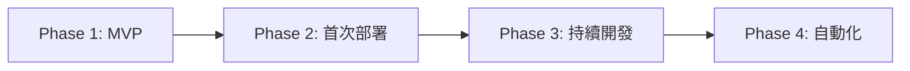
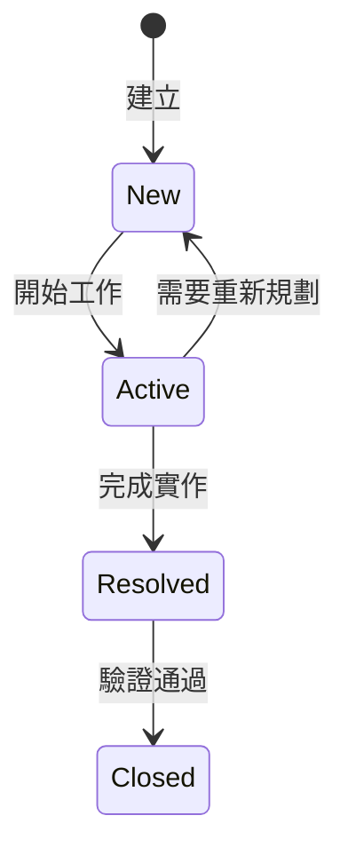
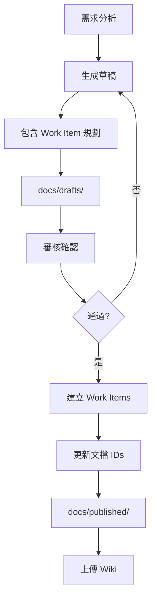

# CLAUDE.md - FHS + FastAPI 重構專案協作指南 v2.0

本文件為 Claude Code + Cursor + Azure DevOps 協作開發指南，專門為 API 重構專案（FHS + FastAPI）設計。

## 📋 目錄

1. [專案概述](#專案概述)
2. [安全配置指南](#安全配置指南)
3. [協作角色與職責](#協作角色與職責)
4. [開發階段與里程碑](#開發階段與里程碑)
5. [Work Items 統一管理](#work-items-統一管理)
6. [文檔工作流程](#文檔工作流程)
7. [協作記錄指南](#協作記錄指南)
8. [測試策略與管理](#測試策略與管理)
9. [Azure CLI 命令參考](#azure-cli-命令參考)
10. [快速參考卡](#快速參考卡)
11. [Bubble.io API 相容性](#bubbleio-api-相容性)
12. [注意事項](#注意事項)

---

## 專案概述

### 技術棧
- **架構模式**: FHS (Functional Hierarchy Structure)
- **框架**: FastAPI
- **Python 版本**: 3.10+ (建議使用 3.11)
- **部署平台**: Azure Function App
- **版本控制**: GitHub (主要) + Azure DevOps Repos (鏡像)
- **CI/CD**: GitHub Actions → Azure Functions（MVP 完成後設置）
- **協作工具**: Claude Code + Cursor + Azure DevOps + Serena MCP

### Azure DevOps 專案資訊
- **組織**: airesumeadvisor
- **專案**: API
- **URL**: https://dev.azure.com/airesumeadvisor/API

### FHS + FastAPI 架構規範

```
api_project/
├── CLAUDE.md                    # 本協作指南
├── .cursor/                     # Cursor IDE 配置
├── .serena/                     # Serena MCP 記憶系統
├── legacy/                      # 舊版參考資料
│   └── temp_tests/             # 臨時測試文件
├── docs/                        # 文檔管理
│   ├── drafts/                 # 草稿文檔
│   ├── published/              # 已發布文檔
│   ├── work_items/             # Work Item 記錄
│   └── local/                  # 本地文檔
├── src/                         # FHS 架構原始碼
├── tests/                       # 測試檔案
├── azure/                       # Azure 部署相關
└── .github/                     # CI/CD 配置
```

---

## 安全配置指南

### 環境變數管理

```yaml
# 公開配置（可提交）
EMBEDDING_ENDPOINT: https://wenha-m7qan2zj-swedencentral.cognitiveservices.azure.com/...
LLM2_ENDPOINT: https://wenha-m7qan2zj-swedencentral.cognitiveservices.azure.com

# 敏感配置（絕不提交）- 存放位置：
# 1. Azure Key Vault (生產環境)
# 2. local.settings.json (本地開發)
# 3. GitHub Secrets (CI/CD)
# 4. Azure Function App Configuration (部署環境)
```

### 配置範例

```python
# src/core/config.py
from pydantic_settings import BaseSettings
from azure.keyvault.secrets import SecretClient
from azure.identity import DefaultAzureCredential

class Settings(BaseSettings):
    # 公開配置
    embedding_endpoint: str = "https://..."
    llm2_endpoint: str = "https://..."
    
    # 敏感配置 - 從環境變數或 Key Vault 讀取
    llm2_api_key: str = ""
    openai_api_key: str = ""
    
    def load_from_keyvault(self):
        """生產環境從 Key Vault 載入敏感資訊"""
        keyvault_url = "https://your-keyvault.vault.azure.net"
        credential = DefaultAzureCredential()
        client = SecretClient(vault_url=keyvault_url, credential=credential)
        
        self.llm2_api_key = client.get_secret("LLM2-API-KEY").value
        self.openai_api_key = client.get_secret("OPENAI-API-KEY").value
```

### 安全檢查清單
- [ ] 確保 .gitignore 包含所有敏感檔案
- [ ] API Keys 存放在環境變數或 Key Vault
- [ ] local.settings.json 不提交到版本控制
- [ ] 使用 Managed Identity 存取 Azure 資源

---

## 協作角色與職責

### 責任分配矩陣 (RACI)

| 任務 | Claude | Cursor | WenHao |
|------|--------|--------|--------|
| 需求分析 | R | C | A |
| 架構設計 | R | C | A |
| 文檔撰寫 | R | I | A |
| Work Item 建立 | R | I | A |
| 程式碼實作 | C | R | A |
| 單元測試 | C | R | A |
| 整合測試 | R | R | A |
| 部署執行 | C | C | R |
| 文檔上傳 | I | I | R |

*R=負責執行, A=最終負責, C=需諮詢, I=需通知*

### 各角色職責說明

**🤖 Claude Code**
- 高層次規劃、架構設計、風險評估
- 生成需求、測試、設計、部署文檔
- Work Items 規劃與建立
- 測試案例設計

**💻 Cursor**
- 程式碼實作與單元測試
- 確保符合 FHS + FastAPI 最佳實踐
- 執行整合測試

**👤 WenHao**
- 審核確認文檔和規劃
- 執行部署與環境配置
- 同步文檔到 DevOps Wiki

---

## 開發階段與里程碑

### 開發流程概覽



### Phase 1: MVP 開發（Week 1-3）
**目標**: 完成核心功能的本地開發
- [ ] 分析原始 API，識別核心模組
- [ ] 設計 FHS 架構
- [ ] 實作基本功能
- [ ] 本地測試通過
- [ ] API 文檔完成

### Phase 2: 首次部署（Week 4）
**目標**: 手動部署到 Azure
- [ ] 準備部署環境
- [ ] 配置環境變數
- [ ] 執行手動部署
- [ ] 線上測試與問題修復
- [ ] 記錄部署步驟

### Phase 3: 持續開發（Week 5-6）
**目標**: 基於部署經驗優化
- [ ] 開發更多模組
- [ ] 優化架構
- [ ] 整合測試
- [ ] 準備自動化

### Phase 4: 自動化與優化（Week 7+）
**目標**: 建立 CI/CD 流程
- [ ] 設置 GitHub Actions
- [ ] 自動化測試
- [ ] 自動化部署
- [ ] 監控優化

### 階段檢查點

**MVP 完成標準**
- 核心 API 模組完成
- 本地測試通過
- 基本錯誤處理
- API 文檔自動生成

**部署完成標準**
- Azure Function App 運行正常
- 環境變數正確配置
- 監控設置完成
- 成本在預算內

---

## Work Items 統一管理

### Work Item 類型與負責人

| 類型 | 預設負責人 | Azure DevOps 使用者 | 職責 |
|------|------------|-------------------|------|
| Epic | Claude | claude@airesumeadvisor.com | 高層次規劃 |
| Feature | Claude | claude@airesumeadvisor.com | 功能設計 |
| User Story | Cursor | cursor@airesumeadvisor.com | 實作細節 |
| Task | 依性質 | 見下方 | 具體執行 |
| Test Case | Claude/Cursor | 見下方 | 測試設計/執行 |
| Bug | 依類型 | 見下方 | 問題解決 |

**Task 負責人分配**
- 程式碼實作 → cursor@airesumeadvisor.com
- 環境設定 → wenhao@airesumeadvisor.com
- 部署配置 → wenhao@airesumeadvisor.com
- 文檔撰寫 → claude@airesumeadvisor.com

### Work Item 狀態流程



### 狀態管理最佳實踐
1. **即時更新**: 開始工作時立即更新為 Active
2. **單一負責**: 同時只有一個 Work Item 處於 Active
3. **完成即報**: 完成後立即更新狀態
4. **驗收確認**: Resolved → Closed 需要明確驗收

---

## 文檔工作流程

### 文檔生命週期



### 文檔分類
- **drafts/**: 待審核文檔（含 [PENDING_XXX_ID] 佔位符）
- **published/**: 已發布文檔（含實際 Work Item URLs）
- **work_items/**: Work Item 建立記錄
- **local/**: 本地文檔（不上傳）

### 文檔命名規範
```yaml
需求文檔: REQ_[模組]_[YYYYMMDD].md
測試文檔: TEST_[模組]_[YYYYMMDD].md
設計文檔: DESIGN_[模組]_[YYYYMMDD].md
部署文檔: DEPLOY_[模組]_[YYYYMMDD].md
API文檔: API_[模組]_[版本].md
Work Item: WI_[模組]_[YYYYMMDD].json
```

---

## 協作記錄指南

### 記錄格式 (5W1H)
```markdown
### [HH:MM] [工具] - [動作]
Who: [Cursor/Claude Code/用戶]
What: [做了什麼]
Why: [為什麼做]
When: [台灣時間]
How: [怎麼做的]
```

### 必須記錄的操作
- 代碼修改
- 配置變更
- 測試執行
- 部署操作
- 文檔更新
- 技術決策

### Cursor 任務分派
當 Claude 分派任務時：
1. 詳細規格記錄在 COLLABORATION_LOG.md
2. 給用戶簡短提示：
```
請查看 COLLABORATION_LOG.md 中的任務指派：
📍 位置：第 XXX-XXX 行
⏰ 時間：[HH:MM] 
📋 任務：[簡述]
```

---

## 測試策略與管理

### 測試層級
- **單元測試**: 覆蓋率 > 80%
- **整合測試**: 涵蓋關鍵路徑
- **KPI 測試**: 一致性和效能測試

### KPI 測試標準
```yaml
一致性測試:
  測試次數: 50次
  目標:
    短文本: ≥70% 一致率
    長文本: ≥50% 一致率
    兩次相同: ≥35%
```

### 測試修復流程
```markdown
### [時間] 測試修復進度
**問題**: [描述]
**根因**: [分析]
**修復**: [方案]
**狀態**: 
- HH:MM - 發現問題
- HH:MM - 實施修復
- HH:MM - 驗證通過
```

---

## Azure CLI 命令參考

### 初始設置
```bash
az login
az devops configure --defaults organization=https://dev.azure.com/airesumeadvisor project=API
```

### Work Item 管理
```bash
# 建立 Work Item
az boards work-item create \
  --title "[標題]" \
  --type [類型] \
  --project API \
  --assigned-to "[email]"

# 更新狀態
az boards work-item update --id [ID] --state [狀態]

# 查詢 Work Items
az boards query --wiql "[查詢語句]"
```

### 常用查詢
```bash
# 進行中項目
"SELECT [System.Id], [System.Title] FROM workitems WHERE [System.State] = 'Active'"

# 本週變更
"SELECT * FROM workitems WHERE [System.ChangedDate] >= @Today-7"
```

---

## 快速參考卡

### 日常開發命令
```bash
# 本地測試
pytest tests/unit/
uvicorn src.main:app --reload

# Git 提交（含 Work Item）
git commit -m "AB#[ID] [說明]"

# 記錄進度
claude "將今日開發成果記錄到 Serena"
```

### 文檔管理命令
```bash
# 生成文檔
claude "為 [模組] 生成需求文檔"

# 建立 Work Items
claude "建立文檔中的 Work Items"

# 檢查待同步
claude "列出待上傳的文檔"
```

### 部署相關命令
```bash
# 環境檢查
python --version

# 部署準備
claude "生成部署檢查清單"

# 配置環境
az functionapp config appsettings set ...
```

---

## Bubble.io API 相容性

### 關鍵約束
- **絕對禁止** 使用 `Optional[Type]` 欄位
- **必須確保** 所有欄位始終存在
- **失敗情況** 回傳空值而非 `null`
- **HTTP 200** 必須使用相同 JSON 結構

### 正確範例
```python
class ApiResponse(BaseModel):
    success: bool
    data: DataModel              # 總是存在
    error: ErrorModel           # 固定結構
    
class DataModel(BaseModel):
    results: List[str] = []     # 失敗時空陣列
    count: int = 0              # 失敗時為 0
    message: str = ""           # 失敗時空字串
```

---

## 注意事項

### 重要提醒
1. 敏感資訊絕不提交到版本控制
2. 使用 Azure CLI 存取 DevOps（無需 PAT token）
3. 建立 Work Item 時指定正確的 Owner
4. MVP 優先，手動部署成功後再考慮 CI/CD
5. 確保 Python 3.10+ 避免相容性問題
6. 注意 Azure 成本監控
7. **Git 提交規則**：由於專案已設置 CI/CD pipeline，Claude Code **絕對不可以**自行執行 `git commit`。任何提交前必須：
   - 先向用戶說明要提交的內容
   - 獲得用戶明確同意後才能執行
   - 提交訊息需包含清晰的變更說明

### 臨時文件管理
- 臨時測試文件放在 `legacy/temp_tests/`
- 正式測試放在 `tests/`
- 工具腳本放在 `tools/`

### Serena 記憶系統
```yaml
.serena/memories/:
  api_analysis/: 原始 API 分析
  daily_notes/: 每日開發進度
  decisions/: 架構決策記錄
```

---

**文檔版本**: 2.0.0  
**最後更新**: 2025-07-03  
**維護者**: Claude Code + WenHao  
**適用專案**: FHS + FastAPI API 重構專案

---

## 附錄：核心工作流程

### 1. 分析與設計
```bash
# 分析原始 API
claude "分析 legacy/old_api_code/ 識別重構點"

# 設計架構
claude "設計 [模組] 的 FHS 架構"

# 生成文檔
claude "生成含 Work Items 的設計文檔"
```

### 2. 開發與測試
```bash
# 實作功能
@docs/published/design/DESIGN_[模組].md
"基於設計文檔實作功能"

# 執行測試
pytest tests/unit/test_[模組].py

# 整合測試
pytest tests/integration/ --env=local
```

### 3. 部署與維運
```bash
# 手動部署
claude "生成 Azure 部署步驟"

# 配置環境
az functionapp config appsettings set ...

# 驗證部署
claude "生成部署驗證清單"
```

### 4. 持續改進
```bash
# 技術債務評估
claude "評估當前技術債務"

# 效能優化
claude "分析效能瓶頸並提出優化方案"

# 文檔更新
claude "更新相關文檔確保一致性"
```