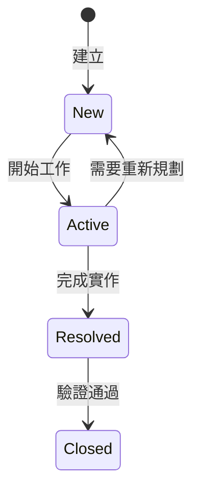
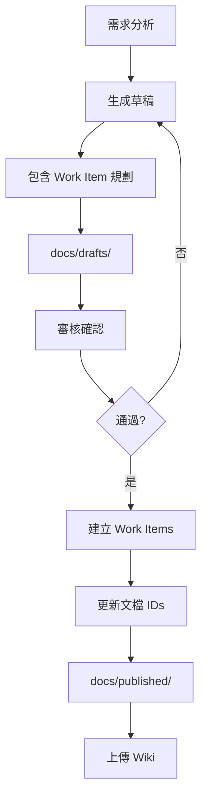

# CLAUDE.md - FHS + FastAPI 重構專案協作指南 v2.0

本文件為 Claude Code + Cursor + Azure DevOps 協作開發指南，專門為 API 重構專案（FHS + FastAPI）設計。

## 📋 目錄

1. [專案概述](#專案概述)
2. [安全配置指南](#安全配置指南)
3. [協作角色與職責](#協作角色與職責)
4. [開發階段與里程碑](#開發階段與里程碑)
5. [Work Items 統一管理](#work-items-統一管理)
6. [文檔工作流程](#文檔工作流程)
7. [協作記錄指南](#協作記錄指南)
8. [測試策略與管理](#測試策略與管理)
9. [Azure CLI 命令參考](#azure-cli-命令參考)
10. [快速參考卡](#快速參考卡)
11. [Bubble.io API 相容性](#bubbleio-api-相容性)
12. [注意事項](#注意事項)

---

## 專案概述

### 技術棧
- **架構模式**: FHS (Functional Hierarchy Structure)
- **框架**: FastAPI
- **Python 版本**: 3.10+ (建議使用 3.11)
- **部署平台**: Azure Function App
- **版本控制**: GitHub (主要) + Azure DevOps Repos (鏡像)
- **CI/CD**: GitHub Actions → Azure Functions（MVP 完成後設置）
- **協作工具**: Claude Code + Cursor + Azure DevOps + Serena MCP

### Azure DevOps 專案資訊
- **組織**: airesumeadvisor
- **專案**: API
- **URL**: https://dev.azure.com/airesumeadvisor/API

### Azure 資源資訊
- **Subscription ID**: 5396d388-8261-464e-8ee4-112770674fba
- **Resource Group**: airesumeadvisorfastapi
- **Application Insights**: airesumeadvisorfastapi
- **Tenant**: wenhaoairesumeadvisor.onmicrosoft.com
- **Portal URL**: https://portal.azure.com/#@wenhaoairesumeadvisor.onmicrosoft.com/resource/subscriptions/5396d388-8261-464e-8ee4-112770674fba/resourceGroups/airesumeadvisorfastapi/providers/Microsoft.Insights/components/airesumeadvisorfastapi/overview

### Azure Function App 資訊
- **Function App 名稱**: airesumeadvisor-fastapi
- **基礎 URL**: https://airesumeadvisor-fastapi.azurewebsites.net
- **Host Keys**: 請勿提交到版本控制！存放在：
  - Azure Portal → Function App → Function Keys
  - 本地環境變數或 `.env` 檔案（已加入 .gitignore）
  - Azure Key Vault（生產環境）
- **API URL 格式**:
  ```
  https://airesumeadvisor-fastapi.azurewebsites.net/api/v1/[endpoint]?code=[YOUR_HOST_KEY]
  ```

### FHS + FastAPI 架構規範

```
api_project/
├── CLAUDE.md                    # 本協作指南
├── .cursor/                     # Cursor IDE 配置
├── .serena/                     # Serena MCP 記憶系統
├── legacy/                      # 舊版參考資料
│   └── temp_tests/             # 臨時測試文件
├── docs/                        # 文檔管理
│   ├── drafts/                 # 草稿文檔
│   ├── published/              # 已發布文檔
│   ├── work_items/             # Work Item 記錄
│   └── local/                  # 本地文檔
├── src/                         # FHS 架構原始碼
├── tests/                       # 測試檔案
├── azure/                       # Azure 部署相關
└── .github/                     # CI/CD 配置
```

---

## 安全配置指南

### 環境變數管理

```yaml
# 公開配置（可提交）
EMBEDDING_ENDPOINT: https://wenha-m7qan2zj-swedencentral.cognitiveservices.azure.com/...
LLM2_ENDPOINT: https://wenha-m7qan2zj-swedencentral.cognitiveservices.azure.com

# 敏感配置（絕不提交）- 存放位置：
# 1. Azure Key Vault (生產環境)
# 2. local.settings.json (本地開發)
# 3. GitHub Secrets (CI/CD)
# 4. Azure Function App Configuration (部署環境)
```

### 配置範例

```python
# src/core/config.py
from pydantic_settings import BaseSettings
from azure.keyvault.secrets import SecretClient
from azure.identity import DefaultAzureCredential

class Settings(BaseSettings):
    # 公開配置
    embedding_endpoint: str = "https://..."
    llm2_endpoint: str = "https://..."
    
    # 敏感配置 - 從環境變數或 Key Vault 讀取
    llm2_api_key: str = ""
    openai_api_key: str = ""
    
    def load_from_keyvault(self):
        """生產環境從 Key Vault 載入敏感資訊"""
        keyvault_url = "https://your-keyvault.vault.azure.net"
        credential = DefaultAzureCredential()
        client = SecretClient(vault_url=keyvault_url, credential=credential)
        
        self.llm2_api_key = client.get_secret("LLM2-API-KEY").value
        self.openai_api_key = client.get_secret("OPENAI-API-KEY").value
```

### 安全檢查清單
- [ ] 確保 .gitignore 包含所有敏感檔案
- [ ] API Keys 存放在環境變數或 Key Vault
- [ ] local.settings.json 不提交到版本控制
- [ ] 使用 Managed Identity 存取 Azure 資源

---

## 協作角色與職責

### 責任分配矩陣 (RACI)

| 任務 | Claude | Cursor | WenHao |
|------|--------|--------|--------|
| 需求分析 | R | C | A |
| 架構設計 | R | C | A |
| 文檔撰寫 | R | I | A |
| Work Item 建立 | R | I | A |
| 程式碼實作 | C | R | A |
| 單元測試 | C | R | A |
| 整合測試 | R | R | A |
| 部署執行 | C | C | R |
| 文檔上傳 | I | I | R |

*R=負責執行, A=最終負責, C=需諮詢, I=需通知*

### 各角色職責說明

**🤖 Claude Code**
- 高層次規劃、架構設計、風險評估
- 生成需求、測試、設計、部署文檔
- Work Items 規劃與建立
- 測試案例設計

**💻 Cursor**
- 程式碼實作與單元測試
- 確保符合 FHS + FastAPI 最佳實踐
- 執行整合測試

**👤 WenHao**
- 審核確認文檔和規劃
- 執行部署與環境配置
- 同步文檔到 DevOps Wiki

---

## 開發階段與里程碑

### 開發流程概覽


### Phase 1: MVP 開發（Week 1-3）
**目標**: 完成核心功能的本地開發
- [ ] 分析原始 API，識別核心模組
- [ ] 設計 FHS 架構
- [ ] 實作基本功能
- [ ] 本地測試通過
- [ ] API 文檔完成

### Phase 2: 首次部署（Week 4）
**目標**: 手動部署到 Azure
- [ ] 準備部署環境
- [ ] 配置環境變數
- [ ] 執行手動部署
- [ ] 線上測試與問題修復
- [ ] 記錄部署步驟

### Phase 3: 持續開發（Week 5-6）
**目標**: 基於部署經驗優化
- [ ] 開發更多模組
- [ ] 優化架構
- [ ] 整合測試
- [ ] 準備自動化

### Phase 4: 自動化與優化（Week 7+）
**目標**: 建立 CI/CD 流程
- [ ] 設置 GitHub Actions
- [ ] 自動化測試
- [ ] 自動化部署
- [ ] 監控優化

### 階段檢查點

**MVP 完成標準**
- 核心 API 模組完成
- 本地測試通過
- 基本錯誤處理
- API 文檔自動生成

**部署完成標準**
- Azure Function App 運行正常
- 環境變數正確配置
- 監控設置完成
- 成本在預算內

---

## Work Items 統一管理

### Work Item 類型與負責人

| 類型 | 預設負責人 | Azure DevOps 使用者 | 職責 |
|------|------------|-------------------|------|
| Epic | Claude | claude@airesumeadvisor.com | 高層次規劃 |
| Feature | Claude | claude@airesumeadvisor.com | 功能設計 |
| User Story | Cursor | cursor@airesumeadvisor.com | 實作細節 |
| Task | 依性質 | 見下方 | 具體執行 |
| Test Case | Claude/Cursor | 見下方 | 測試設計/執行 |
| Bug | 依類型 | 見下方 | 問題解決 |

**Task 負責人分配**
- 程式碼實作 → cursor@airesumeadvisor.com
- 環境設定 → wenhao@airesumeadvisor.com
- 部署配置 → wenhao@airesumeadvisor.com
- 文檔撰寫 → claude@airesumeadvisor.com

### Work Item 狀態流程



### 狀態管理最佳實踐
1. **即時更新**: 開始工作時立即更新為 Active
2. **單一負責**: 同時只有一個 Work Item 處於 Active
3. **完成即報**: 完成後立即更新狀態
4. **驗收確認**: Resolved → Closed 需要明確驗收

---

## 文檔工作流程

### 文檔生命週期



### 文檔分類
- **drafts/**: 待審核文檔（含 [PENDING_XXX_ID] 佔位符）
- **published/**: 已發布文檔（含實際 Work Item URLs）
- **work_items/**: Work Item 建立記錄
- **local/**: 本地文檔（不上傳）

### 文檔命名規範
```yaml
需求文檔: REQ_[模組]_[YYYYMMDD].md
測試文檔: TEST_[模組]_[YYYYMMDD].md
設計文檔: DESIGN_[模組]_[YYYYMMDD].md
部署文檔: DEPLOY_[模組]_[YYYYMMDD].md
API文檔: API_[模組]_[版本].md
Work Item: WI_[模組]_[YYYYMMDD].json
```

---

## 協作記錄指南

### 記錄格式 (5W1H)
```markdown
### [HH:MM] [工具] - [動作]
Who: [Cursor/Claude Code/用戶]
What: [做了什麼]
Why: [為什麼做]
When: [台灣時間]
How: [怎麼做的]
```

### 必須記錄的操作
- 代碼修改
- 配置變更
- 測試執行
- 部署操作
- 文檔更新
- 技術決策

### Cursor 任務分派
當 Claude 分派任務時：
1. 詳細規格記錄在 COLLABORATION_LOG.md
2. 給用戶簡短提示：
```
請查看 COLLABORATION_LOG.md 中的任務指派：
📍 位置：第 XXX-XXX 行
⏰ 時間：[HH:MM] 
📋 任務：[簡述]
```

---

## 測試策略與管理

### 測試層級
- **單元測試**: 覆蓋率 > 80%
- **整合測試**: 涵蓋關鍵路徑
- **KPI 測試**: 一致性和效能測試

### KPI 測試標準
```yaml
一致性測試:
  測試次數: 50次
  目標:
    短文本: ≥70% 一致率
    長文本: ≥50% 一致率
    兩次相同: ≥35%
```

### 測試修復流程
```markdown
### [時間] 測試修復進度
**問題**: [描述]
**根因**: [分析]
**修復**: [方案]
**狀態**: 
- HH:MM - 發現問題
- HH:MM - 實施修復
- HH:MM - 驗證通過
```

---

## Azure CLI 命令參考

### 初始設置
```bash
az login
az account set --subscription "5396d388-8261-464e-8ee4-112770674fba"
az configure --defaults group=airesumeadvisorfastapi
az devops configure --defaults organization=https://dev.azure.com/airesumeadvisor project=API
```

### Work Item 管理
```bash
# 建立 Work Item
az boards work-item create \
  --title "[標題]" \
  --type [類型] \
  --project API \
  --assigned-to "[email]"

# 更新狀態
az boards work-item update --id [ID] --state [狀態]

# 查詢 Work Items
az boards query --wiql "[查詢語句]"
```

### Application Insights 查詢
```bash
# 查詢最近的 customEvents
az monitor app-insights query \
  --app airesumeadvisorfastapi \
  --analytics-query "customEvents | take 10"

# 查詢不支援語言的 JD preview
az monitor app-insights query \
  --app airesumeadvisorfastapi \
  --analytics-query "customEvents | where name == 'UnsupportedLanguageSkipped' | project timestamp, customDimensions.detected_language, customDimensions.jd_preview | take 5"

# 查詢 API 效能指標
az monitor app-insights query \
  --app airesumeadvisorfastapi \
  --analytics-query "customEvents | where name == 'RequestTracked' | summarize avg(todouble(customDimensions.duration_ms)) by tostring(customDimensions.endpoint)"
```

### 常用查詢
```bash
# 進行中項目
"SELECT [System.Id], [System.Title] FROM workitems WHERE [System.State] = 'Active'"

# 本週變更
"SELECT * FROM workitems WHERE [System.ChangedDate] >= @Today-7"
```

---

## 快速參考卡

### 日常開發命令
```bash
# 本地測試
pytest tests/unit/
uvicorn src.main:app --reload

# 測試 Azure Function App
curl -X POST "https://airesumeadvisor-fastapi.azurewebsites.net/api/v1/extract-jd-keywords?code=[YOUR_HOST_KEY]" \
  -H "Content-Type: application/json" \
  -d '{"job_description": "Python developer needed", "language": "en"}'

# Git 提交（含 Work Item）
git commit -m "AB#[ID] [說明]"

# 記錄進度
claude "將今日開發成果記錄到 Serena"
```

### 文檔管理命令
```bash
# 生成文檔
claude "為 [模組] 生成需求文檔"

# 建立 Work Items
claude "建立文檔中的 Work Items"

# 檢查待同步
claude "列出待上傳的文檔"
```

### 部署相關命令
```bash
# 環境檢查
python --version

# 部署準備
claude "生成部署檢查清單"

# 配置環境
az functionapp config appsettings set ...
```

---

## Bubble.io API 相容性

### 關鍵約束
- **絕對禁止** 使用 `Optional[Type]` 欄位
- **必須確保** 所有欄位始終存在
- **失敗情況** 回傳空值而非 `null`
- **HTTP 200** 必須使用相同 JSON 結構

### 正確範例
```python
class ApiResponse(BaseModel):
    success: bool
    data: DataModel              # 總是存在
    error: ErrorModel           # 固定結構
    
class DataModel(BaseModel):
    results: List[str] = []     # 失敗時空陣列
    count: int = 0              # 失敗時為 0
    message: str = ""           # 失敗時空字串
```

---

## 注意事項

### 重要提醒
1. 敏感資訊絕不提交到版本控制
2. 使用 Azure CLI 存取 DevOps（無需 PAT token）
3. 建立 Work Item 時指定正確的 Owner
4. MVP 優先，手動部署成功後再考慮 CI/CD
5. 確保 Python 3.10+ 避免相容性問題
6. 注意 Azure 成本監控
7. **Git 提交規則**：由於專案已設置 CI/CD pipeline，Claude Code **絕對不可以**自行執行 `git commit`。任何提交前必須：
   - 執行預提交測試：`./run_precommit_tests.sh`
   - 向用戶展示完整測試結果
   - 確保所有測試通過（包括代碼風格檢查）
   - 詳細說明要提交的內容
   - 獲得用戶明確同意後才能執行
   - 提交訊息需包含清晰的變更說明
8. **時間處理規則**：任何需要使用日期或時間的場合（如文檔命名、日誌記錄、時間戳等），必須：
   - 先使用 Bash 工具執行 `TZ='Asia/Taipei' date '+%Y-%m-%d %H:%M:%S %Z'` 獲取準確的台灣時間
   - 文檔命名使用格式：`[TYPE]_[MODULE]_YYYYMMDD.md`（例：`TEST_GAP_ANALYSIS_20250711.md`）
   - 日誌記錄使用格式：`YYYY-MM-DD HH:MM:SS CST`
   - 絕不使用 <env> 中的日期或憑空推測日期

### 環境變數問題解決方案

#### 問題：EMBEDDING_API_KEY environment variable is required

**根本原因**：
1. `embedding_client.py` 使用 `os.getenv()` 直接讀取環境變數
2. `main.py` 沒有載入 `.env` 檔案
3. pydantic_settings 只對 Settings 類別有效，不影響 `os.getenv()`

**解決方案**：

1. **本地開發** - 在啟動前載入 .env：
   ```bash
   # 方法 1: 使用 python-dotenv
   python -c "from dotenv import load_dotenv; load_dotenv()" && uvicorn src.main:app --reload
   
   # 方法 2: 設置環境變數
   export EMBEDDING_API_KEY="your-api-key"
   uvicorn src.main:app --reload
   
   # 方法 3: 在 main.py 添加 (推薦)
   from dotenv import load_dotenv
   load_dotenv()  # 在 import 後立即載入
   ```

2. **生產環境** - Azure Function App 配置：
   ```bash
   az functionapp config appsettings set \
     --name airesumeadvisorfastapi \
     --resource-group airesumeadvisorfastapi \
     --settings EMBEDDING_API_KEY="your-api-key"
   ```

3. **統一解決方案** - 修改 embedding_client.py 使用 settings：
   ```python
   # 改為從 settings 讀取
   from src.core.config import get_settings
   
   def get_azure_embedding_client():
       settings = get_settings()
       return AzureEmbeddingClient(
           endpoint=settings.embedding_endpoint,
           api_key=settings.embedding_api_key
       )
   ```

**建議**：使用方法 3，確保所有環境變數都通過統一的 Settings 管理。

### 預提交測試流程

#### 測試策略規則

**使用 `./run_precommit_tests.sh --no-api` 的情況：**

1. **文檔類修改**：
   - `*.md` 檔案（README, CLAUDE.md, 文檔）
   - `docs/` 目錄下的任何檔案
   - `.txt`, `.json` 配置檔（不影響代碼邏輯）

2. **配置檔修改**：
   - `.gitignore`, `.env.example`
   - `azure/monitoring/*.json` (workbook 配置)
   - 不影響程式執行的 YAML/JSON 檔案

3. **測試檔案修改**：
   - 只修改 `tests/` 目錄下的測試檔案
   - 添加新的測試案例（不修改主程式碼）

4. **工具腳本修改**：
   - `tools/` 目錄下的獨立腳本
   - Shell 腳本（`.sh` 檔案）

**必須使用完整測試 `./run_precommit_tests.sh` 的情況：**

1. **核心程式碼修改**：
   - `src/` 目錄下的任何 `.py` 檔案
   - API 端點修改 (`src/api/`)
   - 服務層修改 (`src/services/`)
   - 模型修改 (`src/models/`)

2. **關鍵配置修改**：
   - `src/core/config.py`
   - `local.settings.json`
   - `requirements.txt` 或依賴相關檔案

3. **部署相關修改**：
   - `azure-functions/` 目錄
   - `main.py` 或 `function_app.py`
   - Azure 部署配置

4. **整合相關修改**：
   - 中介軟體 (`src/middleware/`)
   - 監控服務 (`monitoring_service.py`)
   - 錯誤處理邏輯

5. **最終提交前**：
   - 無論修改什麼，最終 push 前必須執行完整測試
   - 確保所有功能正常運作

#### 執行測試命令
```bash
# 完整測試（修改程式碼後必須執行）
./run_precommit_tests.sh

# 快速測試（僅修改文檔/配置時可用）
./run_precommit_tests.sh --no-api
```

#### 測試決策流程圖
```
修改了檔案？
├─ 是 src/*.py 檔案？ → 完整測試
├─ 是 requirements.txt？ → 完整測試  
├─ 是 main.py？ → 完整測試
├─ 是 middleware/*.py？ → 完整測試
├─ 只是 *.md 檔案？ → --no-api
├─ 只是 docs/* 檔案？ → --no-api
├─ 只是 tests/* 檔案？ → --no-api
├─ 只是 .json 配置？ → --no-api
└─ 準備 push？ → 完整測試（無論之前如何）
```

#### 實際範例
```bash
# 情境 1: 修改了 monitoring_service.py
git status  # modified: src/core/monitoring_service.py
./run_precommit_tests.sh  # 必須完整測試

# 情境 2: 只更新了文檔
git status  # modified: docs/monitoring-summary.md
./run_precommit_tests.sh --no-api  # 快速測試即可

# 情境 3: 修改了多個檔案
git status  # modified: CLAUDE.md, src/api/endpoints.py
./run_precommit_tests.sh  # 因為有 src/ 檔案，必須完整測試

# 情境 4: 準備最終提交
git status  # 任何檔案
./run_precommit_tests.sh  # 最終提交前，一律完整測試
```

#### 測試涵蓋範圍
- ✅ 單元測試（Core Models, API Handlers, Services）
- ✅ 整合測試（Azure Deployment, Performance）
- ✅ 性能測試（並行處理、緩存機制）
- ✅ Bubble.io API 相容性測試
- ✅ 代碼風格檢查（ruff）

#### 測試結果要求
提交前必須確保：
- 所有測試通過（Passed）
- 無失敗測試（Failed: 0）
- 代碼風格檢查通過
- 測試結果範例：
```
📊 TEST SUMMARY
═══════════════════════════════════════
Total tests: 8
Passed: 8
Failed: 0
Skipped: 0

✅ All tests passed! Ready to commit.
```

### 代碼風格規範（ruff）

Claude Code 在編寫程式碼時必須遵循 ruff 的代碼風格規範，避免在提交前才發現問題：

#### 常見規則
1. **SIM (simplify) 規則**
   - 使用 `for key in dict:` 而非 `for key in dict.keys()`
   - 使用 `if condition:` 而非 `if condition == True:`
   - 避免不必要的 `else` 區塊

2. **F (Pyflakes) 規則**
   - 移除未使用的 import
   - 移除未使用的變數

3. **E (pycodestyle) 規則**
   - 保持行長度在 88 字元以內
   - 適當的縮排和空格

4. **I (isort) 規則**
   - import 順序：標準庫 → 第三方庫 → 本地模組
   - 每組之間空一行

5. **UP (pyupgrade) 規則**
   - 使用現代 Python 語法
   - 使用 `dict[str, Any]` 而非 `Dict[str, Any]`
   - 使用 f-strings 而非 `.format()`

#### 編碼時注意事項
- 在編寫程式碼時就遵循這些規範
- 使用簡潔的語法和現代 Python 特性
- 保持 import 整潔有序
- 避免過長的行，適當換行

### 臨時文件管理
- 臨時測試文件放在 `legacy/temp_tests/`
- 正式測試放在 `tests/`
- 工具腳本放在 `tools/`

### Serena 記憶系統
```yaml
.serena/memories/:
  api_analysis/: 原始 API 分析
  daily_notes/: 每日開發進度
  decisions/: 架構決策記錄
```

### LLM 呼叫最佳實踐 (重要教訓 - 2025/07/09)

#### 完整保護機制

由於 LLM 的不確定性，所有 LLM 呼叫都必須實作以下保護機制：

1. **空白內容檢測**
   ```python
   def check_for_empty_fields(response: dict) -> list[str]:
       """檢查是否有空白或預設訊息的欄位"""
       empty_fields = []
       
       # 定義每個欄位的預設/空白值
       field_checks = {
           "CoreStrengths": ["<ol></ol>", "<ol><li>Unable to...</li></ol>"],
           "KeyGaps": ["<ol></ol>", "<ol><li>Unable to...</li></ol>"],
           "OverallAssessment": ["<p></p>", "<p>Unable to generate...</p>"]
       }
       
       for field, empty_values in field_checks.items():
           if response.get(field) in empty_values:
               empty_fields.append(field)
       
       return empty_fields
   ```

2. **重試機制 (Retry Mechanism)**
   ```python
   async def call_llm_with_retry(prompt: str, max_attempts: int = 3):
       """帶有重試機制的 LLM 呼叫"""
       retry_delays = [2.0, 4.0, 8.0]  # 指數退避
       
       for attempt in range(max_attempts):
           try:
               result = await llm_call(prompt)
               
               # 檢查是否有空白欄位
               empty_fields = check_for_empty_fields(result)
               if empty_fields and attempt < max_attempts - 1:
                   logger.warning(f"Empty fields on attempt {attempt + 1}: {empty_fields}")
                   await asyncio.sleep(retry_delays[attempt])
                   continue
                   
               return result
               
           except Exception as e:
               if attempt == max_attempts - 1:
                   raise
               await asyncio.sleep(retry_delays[attempt])
   ```

3. **預設訊息 (Fallback Messages)**
   ```python
   def format_with_fallback(items: list[str], field_name: str) -> str:
       """格式化內容，空白時提供預設訊息"""
       if items:
           return '<ol>' + ''.join(f'<li>{item}</li>' for item in items) + '</ol>'
       else:
           return f'<ol><li>Unable to analyze {field_name}. Please try again.</li></ol>'
   ```

4. **完整日誌記錄**
   ```python
   # 記錄 LLM 原始回應
   logger.info(f"[LLM_RESPONSE] Full raw response ({len(response)} chars): {repr(response)}")
   
   # 記錄空白欄位檢測
   if empty_fields:
       logger.error(f"[LLM_EMPTY] Empty fields detected: {empty_fields}")
       monitoring_service.track_event("LLMEmptyFields", {
           "empty_fields": ",".join(empty_fields),
           "attempt": attempt + 1
       })
   ```

5. **監控與追蹤**
   ```python
   # 追蹤 LLM 呼叫指標
   monitoring_service.track_event("LLMCallCompleted", {
       "duration_ms": duration * 1000,
       "retry_count": attempt,
       "had_empty_fields": len(empty_fields) > 0,
       "success": not empty_fields
   })
   ```

#### 實作範例 - Gap Analysis Service

參考 `src/services/gap_analysis.py` 的完整實作：
- 3 次重試機制
- 指數退避 (2s, 4s, 8s)
- 空白欄位檢測
- 預設訊息回傳
- 完整錯誤處理

#### 測試驗證

使用 `test_gap_analysis_with_detailed_logging.py` 進行驗證：
- 76 次測試，100% 成功率
- 0 個空白欄位
- 平均回應時間 19.64 秒
- 完整日誌記錄

**標準測試程序**：
```bash
# 背景執行 100 次測試
nohup python test_gap_analysis_with_detailed_logging.py 100 > test_100_output.log 2>&1 &

# 監控進度
tail -f gap_analysis_test_results_*/gap_analysis_test_*.log | grep -E "Test #|Summary"
```

詳細指南請參考：[TEST_LLM_VALIDATION_GUIDE_20250709.md](docs/published/TEST_LLM_VALIDATION_GUIDE_20250709.md)

### API 測試最佳實踐 (重要教訓 - 2025/07/09)

#### 基本原則
**任何 API 測試都必須記錄完整的請求和回應內容**。這是 debug 的基本需求，沒有詳細日誌，失敗時完全無法分析。

#### 測試腳本必須包含

1. **完整請求記錄**
   ```python
   print(f"[{datetime.now()}] Test #{iteration}", flush=True)
   print(f"Request URL: {url}", flush=True)
   print(f"Request payload: {json.dumps(payload, indent=2)}", flush=True)
   print(f"Request headers: {headers}", flush=True)
   ```

2. **完整回應記錄**
   ```python
   print(f"Response status: {response.status_code}", flush=True)
   print(f"Response time: {duration:.2f}s", flush=True)
   print(f"Response headers: {dict(response.headers)}", flush=True)
   print(f"Response body: {json.dumps(response.json(), indent=2)}", flush=True)
   ```

3. **每個欄位的實際值**
   ```python
   # 不只記錄「空/非空」，要記錄實際內容和統計
   core_strengths = gap.get('CoreStrengths', 'MISSING')
   items_count = len(re.findall(r'<li>', core_strengths))
   print(f"CoreStrengths: {items_count} items - {core_strengths[:100]}...")
   ```

4. **失敗時的詳細資訊**
   ```python
   except Exception as e:
       print(f"ERROR Details:", flush=True)
       print(f"  - Type: {type(e).__name__}", flush=True)
       print(f"  - Message: {str(e)}", flush=True)
       print(f"  - Traceback: {traceback.format_exc()}", flush=True)
       print(f"  - Request data: {json.dumps(payload)}", flush=True)
   ```

5. **保存個別回應檔案**
   ```python
   # 每個測試保存獨立檔案，方便後續分析
   with open(f"response_{test_id:03d}.json", "w") as f:
       json.dump({
           "request": payload,
           "response": response_data,
           "metadata": {
               "timestamp": datetime.now().isoformat(),
               "duration": duration,
               "status": response.status_code
           }
       }, f, indent=2, ensure_ascii=False)
   ```

6. **使用無緩衝輸出**
   ```bash
   # Python 預設會緩衝輸出，測試時必須使用 -u 參數
   python -u test_script.py > test_log.txt 2>&1 &
   
   # 或在程式中強制 flush
   print("Important log", flush=True)
   ```

#### 錯誤思維避免
- ❌ 只關注「統計」而非「內容」
- ❌ 假設只要知道成功/失敗就夠了
- ❌ 認為摘要資訊足以 debug
- ❌ 忽略 Python 輸出緩衝問題
- ✅ 記錄所有可能需要的資訊
- ✅ 寧可資訊過多，不要資訊不足
- ✅ 考慮未來 debug 的需求
- ✅ 確保即時看到測試進度

#### 完整測試腳本範例
```python
async def test_api_with_full_logging(url, payload, test_id):
    """正確的 API 測試方式，包含完整日誌"""
    print(f"\n{'='*60}", flush=True)
    print(f"[{datetime.now()}] Starting Test #{test_id}", flush=True)
    print(f"URL: {url}", flush=True)
    print(f"Payload: {json.dumps(payload, indent=2)}", flush=True)
    
    start_time = time.time()
    
    try:
        response = await client.post(url, json=payload, timeout=60)
        duration = time.time() - start_time
        
        # 記錄完整回應
        print(f"Status: {response.status_code} in {duration:.2f}s", flush=True)
        response_data = response.json()
        
        # 分析並記錄關鍵欄位
        if "data" in response_data:
            for key, value in response_data["data"].items():
                value_type = type(value).__name__
                value_preview = str(value)[:200] if not isinstance(value, (dict, list)) else f"{len(value)} items"
                print(f"  {key}: {value_type} = {value_preview}", flush=True)
        
        # 檢查特定欄位
        if "gap_analysis" in response_data.get("data", {}):
            gap = response_data["data"]["gap_analysis"]
            for field in ["CoreStrengths", "KeyGaps", "QuickImprovements", "OverallAssessment"]:
                content = gap.get(field, "MISSING")
                if content in ["<ol></ol>", "<p></p>", ""]:
                    print(f"  ⚠️  {field}: EMPTY!", flush=True)
                else:
                    text_len = len(re.sub(r'<[^>]+>', '', content))
                    print(f"  ✅ {field}: {text_len} chars", flush=True)
        
        # 保存完整回應
        filename = f"response_{test_id:03d}_{response.status_code}.json"
        with open(filename, "w") as f:
            json.dump({
                "test_id": test_id,
                "timestamp": datetime.now().isoformat(),
                "duration_seconds": duration,
                "request": {
                    "url": url,
                    "payload": payload
                },
                "response": {
                    "status": response.status_code,
                    "headers": dict(response.headers),
                    "body": response_data
                }
            }, f, indent=2, ensure_ascii=False)
        print(f"  💾 Saved to {filename}", flush=True)
            
    except Exception as e:
        print(f"❌ ERROR in test #{test_id}:", flush=True)
        print(f"  Type: {type(e).__name__}", flush=True)
        print(f"  Message: {str(e)}", flush=True)
        print(f"  Duration: {time.time() - start_time:.2f}s", flush=True)
        
        # 保存錯誤資訊
        with open(f"error_{test_id:03d}.json", "w") as f:
            json.dump({
                "test_id": test_id,
                "timestamp": datetime.now().isoformat(),
                "error": {
                    "type": type(e).__name__,
                    "message": str(e),
                    "traceback": traceback.format_exc()
                },
                "request": payload
            }, f, indent=2)
```

#### 監控測試進度
```python
# 每 N 個測試顯示統計
if test_id % 10 == 0:
    success_rate = (success_count / test_id) * 100
    avg_time = sum(durations[-10:]) / len(durations[-10:])
    print(f"\n📊 Progress: {test_id}/100 ({success_rate:.1f}% success, avg {avg_time:.2f}s)", flush=True)
```

---

## Azure Monitor Workbook 格式注意事項

### Workbook JSON 格式要求

在建立或編輯 Azure Monitor Workbook 時，使用 Advanced Editor 需要注意以下 JSON 格式要求：

1. **查詢字串格式**：
   - `query` 欄位的值必須是**單行字串**（不能有換行符號）
   - 所有 KQL 查詢語句必須在同一行，使用空格分隔不同的子句
   - 範例：
     ```json
     "query": "customEvents | where timestamp {TimeRange} | where name == \"RequestTracked\" | summarize count() by endpoint"
     ```

2. **字串中的引號處理**：
   - 在查詢字串中的引號必須使用反斜線逃脫：`\"`
   - 正確：`"query": "customEvents | where name == \"RequestTracked\""`
   - 錯誤：`"query": "customEvents | where name == "RequestTracked""`

3. **物件格式一致性**：
   - 保持 JSON 物件的格式一致
   - 陣列元素格式：`{"durationMs": 300000}` 而非 `{"durationMs":300000}`

4. **常見錯誤訊息**：
   - `Bad control character in string literal in JSON` - 通常是因為查詢字串中有換行符號
   - 解決方法：將多行查詢合併為單行，使用管道符號 `|` 和空格分隔

### 最佳實踐

1. **先在 Query Explorer 測試**：
   - 在 Application Insights 的 Logs 介面測試 KQL 查詢
   - 確認查詢正確後，再複製到 Workbook

2. **逐步建立 Workbook**：
   - 使用 UI 介面逐個添加元件，而非直接編輯 JSON
   - 每個元件測試無誤後再添加下一個

3. **JSON 編輯技巧**：
   - 使用 JSON 格式化工具先驗證格式
   - 將長查詢先在文字編輯器中編寫為單行
   - 使用查找替換功能處理引號逃脫

---

**文檔版本**: 2.4.0  
**最後更新**: 2025-07-09  
**維護者**: Claude Code + WenHao  
**適用專案**: FHS + FastAPI API 重構專案

---

## 附錄：核心工作流程

### 1. 分析與設計
```bash
# 分析原始 API
claude "分析 legacy/old_api_code/ 識別重構點"

# 設計架構
claude "設計 [模組] 的 FHS 架構"

# 生成文檔
claude "生成含 Work Items 的設計文檔"
```

### 2. 開發與測試
```bash
# 實作功能
@docs/published/design/DESIGN_[模組].md
"基於設計文檔實作功能"

# 執行測試
pytest tests/unit/test_[模組].py

# 整合測試
pytest tests/integration/ --env=local
```

### 3. 部署與維運
```bash
# 手動部署
claude "生成 Azure 部署步驟"

# 配置環境變數
az functionapp config appsettings set \
  --name airesumeadvisorfastapi \
  --resource-group airesumeadvisorfastapi \
  --settings KEY=VALUE

# 查看 Function App 日誌
az functionapp logs --name airesumeadvisorfastapi --type application

# 驗證部署
claude "生成部署驗證清單"
```

### 4. 持續改進
```bash
# 技術債務評估
claude "評估當前技術債務"

# 效能優化
claude "分析效能瓶頸並提出優化方案"

# 文檔更新
claude "更新相關文檔確保一致性"
```