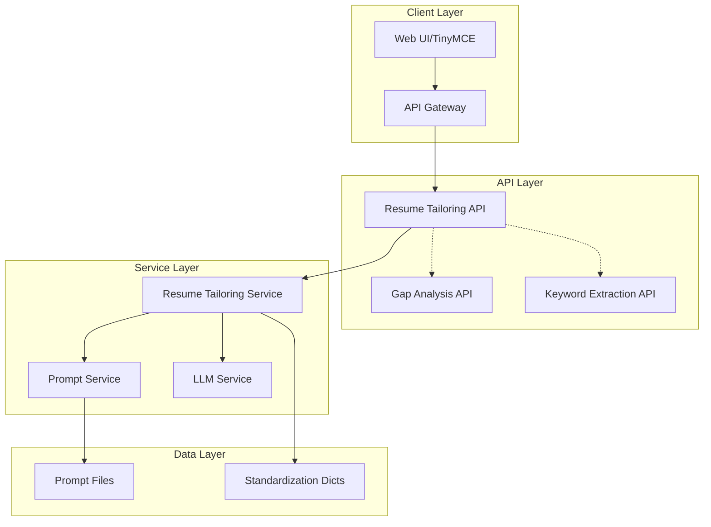
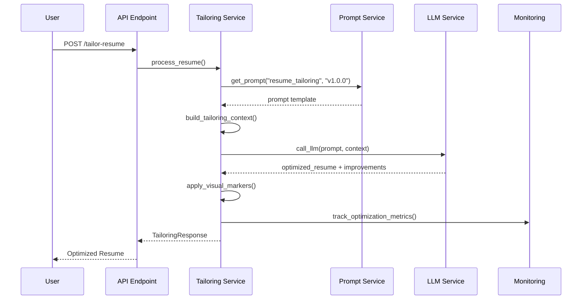

# 架構設計文檔：Resume Tailoring Service

**文檔編號**: ARCH_RESUME_TAILORING_20250110  
**版本**: 1.0  
**日期**: 2025-01-10  
**作者**: Claude  
**狀態**: 待審核

## 1. 架構概述

### 1.1 服務定位
Resume Tailoring Service 是一個基於 Gap Analysis 結果自動優化履歷的微服務，通過智能化的內容改寫和關鍵字整合，提升履歷與目標職位的匹配度。

### 1.2 架構原則
- **單一職責**：專注於履歷優化
- **鬆耦合**：通過標準化接口與其他服務交互
- **可擴展**：支援多語言和多種優化策略
- **可追蹤**：所有優化都有視覺標記

## 2. 系統架構

### 2.1 整體架構圖



### 2.2 數據流程圖



## 3. 組件設計

### 3.1 API Layer

#### 3.1.1 Resume Tailoring Endpoint
```python
# src/api/v1/resume_tailoring.py
@router.post("/tailor-resume")
async def tailor_resume(
    request: TailorResumeRequest,
    settings: Settings = Depends(get_settings)
) -> TailoringResponse:
    """優化履歷以匹配目標職位"""
```

#### 3.1.2 Request/Response Models
```python
# src/models/api/resume_tailoring.py
class TailorResumeRequest(BaseModel):
    job_description: str
    original_resume: str  # HTML format
    gap_analysis: GapAnalysisResult
    options: TailoringOptions = TailoringOptions()

class TailoringResponse(BaseResponse):
    data: TailoringResult
    
class TailoringResult(BaseModel):
    optimized_resume: str  # HTML with markers
    applied_improvements: List[str]
    optimization_stats: OptimizationStats
    visual_markers: VisualMarkerStats
```

### 3.2 Service Layer

#### 3.2.1 Resume Tailoring Service
```python
# src/services/resume_tailoring.py
class ResumeTailoringService:
    async def tailor_resume(
        self,
        job_description: str,
        original_resume: str,
        gap_analysis: GapAnalysisResult,
        options: TailoringOptions
    ) -> TailoringResult:
        """主要優化邏輯"""
        
    def _apply_visual_markers(
        self,
        content: str,
        marker_type: str
    ) -> str:
        """應用視覺標記"""
        
    def _extract_improvements(
        self,
        llm_response: dict
    ) -> List[str]:
        """提取應用的改進"""
```

#### 3.2.2 Section Processor
```python
# src/services/resume_sections.py
class SectionProcessor:
    """動態處理存在的履歷章節"""
    
    def identify_sections(self, html: str) -> Dict[str, str]:
        """識別履歷中實際存在的章節"""
        
    def process_available_sections(self, sections: Dict[str, str], context: dict) -> List[Optimization]:
        """只處理存在的章節，並確保 Summary 存在"""
        
    def process_summary(self, content: str, context: dict) -> str:
        """處理或創建 Summary"""
        
    def process_skills(self, content: str, context: dict) -> str:
    def process_experience(self, content: str, context: dict) -> str:
    def process_projects(self, content: str, context: dict) -> str:
    def process_education(self, content: str, context: dict) -> str:
```

### 3.3 Core Components

#### 3.3.1 HTML Parser/Builder
```python
# src/core/html_processor.py
class HTMLProcessor:
    """處理 HTML 履歷的解析和重建"""
    
    def parse_resume(self, html: str) -> ResumeStructure:
    def rebuild_resume(self, structure: ResumeStructure) -> str:
    def apply_css_class(self, element: str, css_class: str) -> str:
```

#### 3.3.2 STAR/PAR Formatter
```python
# src/core/star_formatter.py
class STARFormatter:
    """轉換經歷描述為 STAR/PAR 格式"""
    
    def format_bullet_point(self, text: str, style: str = "STAR") -> str:
    def remove_format_markers(self, text: str) -> str:
```

#### 3.3.3 Language Handler
```python
# src/core/language_handler.py
class LanguageHandler:
    """處理多語言支援"""
    
    def get_prompt_version(self, language: str) -> str:
        """獲取對應語言的 prompt 版本"""
        # 統一使用 v1.0.0.yaml，透過參數控制語言
        return "v1.0.0"
    
    def get_output_language(self, language_code: str) -> str:
        """轉換語言代碼為 LLM 理解的語言名稱"""
        language_map = {
            "en": "English",
            "zh-TW": "Traditional Chinese (繁體中文)"
        }
        return language_map.get(language_code, "English")
```

#### 3.3.4 Terminology Standardizer Integration
```python
# src/services/resume_tailoring.py
from src.services.standardization import get_standardizer

class ResumeTailoringService:
    def __init__(self):
        self.en_standardizer = get_standardizer("en")
        self.zh_tw_standardizer = get_standardizer("zh-TW")
    
    def standardize_keywords(self, keywords: List[str], language: str) -> List[str]:
        """使用對應語言的標準化器處理關鍵字"""
        standardizer = self.en_standardizer if language == "en" else self.zh_tw_standardizer
        result = standardizer.standardize_keywords(keywords)
        return result.standardized_keywords
```

### 3.4 Integration Layer

#### 3.4.1 LLM Integration
```python
# src/integrations/llm_client.py
class ResumeTailoringLLMClient:
    async def optimize_resume(
        self,
        prompt: str,
        context: dict
    ) -> LLMResponse:
        """調用 LLM 進行優化"""
```

## 4. 數據模型

### 4.1 核心數據結構

```python
# src/models/domain/tailoring.py
@dataclass
class OptimizationMarker:
    type: Literal["strength", "keyword", "placeholder", "new", "improvement"]
    content: str
    css_class: str
    section: str

@dataclass
class SectionOptimization:
    section_name: str
    original_content: str
    optimized_content: str
    markers: List[OptimizationMarker]
    improvements: List[str]

@dataclass
class TailoringContext:
    job_description: str
    original_resume: str
    core_strengths: List[str]
    quick_improvements: List[str]
    overall_assessment: str
    covered_keywords: List[str]
    missing_keywords: List[str]
```

### 4.2 配置模型

```python
# src/models/config/tailoring_config.py
class TailoringOptions(BaseModel):
    include_visual_markers: bool = True
    language: str = "en"
    marker_style: str = "css"  # css or data-attribute
    max_keywords_per_section: int = 5
    placeholder_format: str = "[{type}]"
```

## 5. 關鍵算法

### 5.1 Section-by-Section Processing

```python
def process_resume_sections(resume: ResumeStructure, context: TailoringContext):
    """逐節處理履歷優化"""
    optimizations = []
    
    # 1. Summary - 創建或優化
    if not resume.has_summary():
        summary = create_summary(context)
        optimizations.append(SectionOptimization("Summary", "", summary, ...))
    else:
        summary = optimize_summary(resume.summary, context)
        optimizations.append(SectionOptimization("Summary", resume.summary, summary, ...))
    
    # 2. Skills - 重組和關鍵字整合
    skills = optimize_skills(resume.skills, context.missing_keywords)
    
    # 3. Experience - STAR/PAR 格式化
    for exp in resume.experiences:
        optimized = format_experience_star(exp, context)
        optimizations.append(...)
    
    return optimizations
```

### 5.2 Visual Marker Application

```python
def apply_visual_markers(text: str, marker_type: str) -> str:
    """應用視覺標記到文本"""
    css_map = {
        "strength": "opt-strength",
        "keyword": "opt-keyword",
        "placeholder": "opt-placeholder",
        "new": "opt-new",
        "improvement": "opt-improvement"
    }
    
    css_class = css_map.get(marker_type, "opt-generic")
    return f'<span class="{css_class}">{text}</span>'
```

### 5.3 Placeholder Strategy

```python
def insert_placeholder(text: str, placeholder_type: str) -> str:
    """插入量化占位符"""
    placeholders = {
        "team_size": "[TEAM SIZE]",
        "percentage": "[PERCENTAGE]",
        "amount": "[AMOUNT]",
        "number": "[NUMBER]",
        "time_period": "[TIME PERIOD]",
        "user_count": "[USER COUNT]"
    }
    
    placeholder = placeholders.get(placeholder_type, "[VALUE]")
    return apply_visual_markers(placeholder, "placeholder")
```

## 6. 錯誤處理

### 6.1 錯誤類型

```python
# src/exceptions/tailoring_exceptions.py
class TailoringError(BaseException):
    """履歷優化基礎異常"""

class InvalidHTMLError(TailoringError):
    """HTML 格式無效"""

class LLMOptimizationError(TailoringError):
    """LLM 優化失敗"""

class SectionNotFoundError(TailoringError):
    """找不到指定章節"""
```

### 6.2 錯誤處理策略

```python
async def tailor_resume_with_retry(request: TailorResumeRequest) -> TailoringResult:
    """帶重試機制的優化"""
    max_retries = 3
    
    for attempt in range(max_retries):
        try:
            result = await tailor_resume(request)
            validate_optimization_result(result)
            return result
        except LLMOptimizationError as e:
            if attempt < max_retries - 1:
                await asyncio.sleep(2 ** attempt)
                continue
            raise
```

## 7. 性能優化

### 7.1 緩存策略

```python
# 使用 Redis 緩存優化結果
cache_key = f"tailoring:{hash(job_desc + resume + gap_analysis)}"
cache_ttl = 3600  # 1 hour

# 緩存 prompt templates
@lru_cache(maxsize=100)
def get_compiled_prompt(version: str) -> str:
    """緩存編譯後的 prompt"""
```

### 7.2 並發處理

```python
# 並行處理多個章節
async def process_sections_parallel(sections: List[Section]) -> List[Optimization]:
    tasks = [process_section(s) for s in sections]
    return await asyncio.gather(*tasks)
```

## 8. 監控和日誌

### 8.1 關鍵指標

```python
# src/monitoring/tailoring_metrics.py
class TailoringMetrics:
    optimization_duration: float
    sections_processed: int 
    keywords_added: int 
    strengths_highlighted: int
    placeholders_added: int
    llm_retry_count: int
    input_tokens: int  # 輸入 token 數
    output_tokens: int  # 輸出 token 數
    total_cost: float  # 總成本計算
    language: str  # 使用語言
```

### 8.2 日誌策略

```python
# 精簡日誌，只記錄關鍵資訊
logger.info("Resume tailoring started", {
    "language": request.options.language,
    "sections_count": len(identified_sections)
})

logger.info("Resume tailoring completed", {
    "duration_ms": duration * 1000,
    "tokens_used": total_tokens,
    "improvements_applied": len(applied_improvements)
})
```

## 9. 安全考慮

### 9.1 輸入驗證

```python
def validate_resume_html(html: str) -> bool:
    """驗證 HTML 安全性"""
    # 1. 檢查 HTML 結構完整性
    # 2. 防止 XSS 攻擊
    # 3. 限制允許的標籤和屬性
```

### 9.2 輸出消毒

```python
def sanitize_optimized_resume(html: str) -> str:
    """清理優化後的履歷"""
    # 1. 確保只包含允許的 CSS 類
    # 2. 移除潛在的惡意腳本
    # 3. 驗證 HTML 結構
```

### 9.3 TinyMCE 相容性保護

```python
# 重用 Gap Analysis 的 TinyMCE 安全函數
from src.core.tinymce_safety import (
    ensure_tinymce_compatible_html,
    preserve_css_classes,
    validate_html_structure
)

def prepare_for_tinymce(html: str) -> str:
    """確保輸出對 TinyMCE 編輯器安全"""
    # 使用已驗證的安全函數
    html = ensure_tinymce_compatible_html(html)
    
    # 保護優化標記類名
    allowed_classes = [
        "opt-strength", 
        "opt-keyword", 
        "opt-placeholder", 
        "opt-new", 
        "opt-improvement"
    ]
    html = preserve_css_classes(html, allowed_classes)
    
    return html
```

## 10. 測試策略

### 10.1 單元測試

```python
# tests/unit/test_resume_tailoring.py
class TestResumeTailoring:
    def test_section_identification(self):
    def test_star_formatting(self):
    def test_visual_marker_application(self):
    def test_placeholder_insertion(self):
```

### 10.2 整合測試

```python
# tests/integration/test_tailoring_flow.py
class TestTailoringFlow:
    async def test_complete_optimization(self):
    async def test_with_missing_summary(self):
    async def test_error_handling(self):
```

## 11. 部署考慮

### 11.1 環境變數

```yaml
# Resume Tailoring 專用配置
TAILORING_LLM_MODEL: "gpt-4o-2"
TAILORING_MAX_TOKENS: "6000"
TAILORING_TEMPERATURE: "0.3"
TAILORING_TOP_P: "0.2"
TAILORING_SUPPORTED_LANGUAGES: "en,zh-TW"
TAILORING_DEFAULT_LANGUAGE: "en"
```

### 11.2 資源需求

- CPU: 2 cores minimum
- Memory: 4GB RAM
- Timeout: 60 seconds per request
- Concurrent requests: 10

## 12. 未來擴展點

### 12.1 短期改進
- 批量處理多份履歷
- 自定義優化規則
- 更多視覺化選項

### 12.2 長期願景
- ML 模型優化建議
- 行業特定模板
- A/B 測試框架

---

**下一步行動**：
1. 審核架構設計
2. 開始實作核心組件
3. 建立測試框架