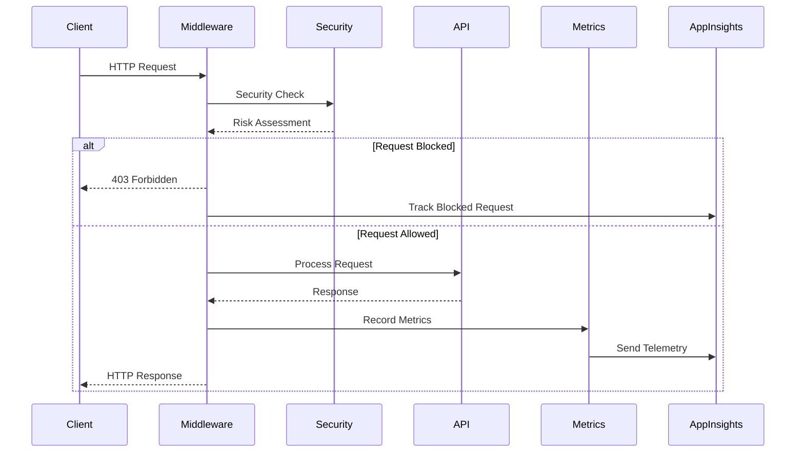
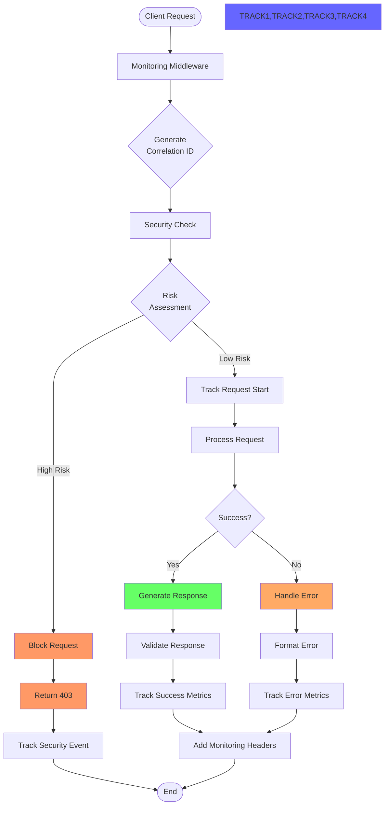
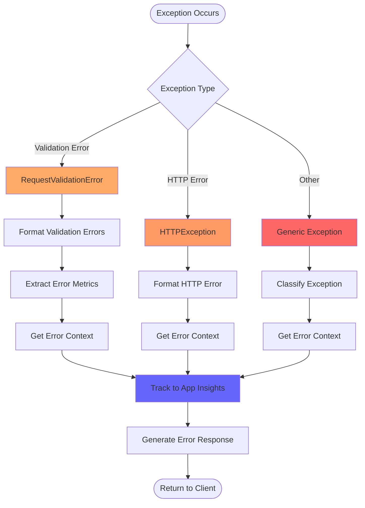
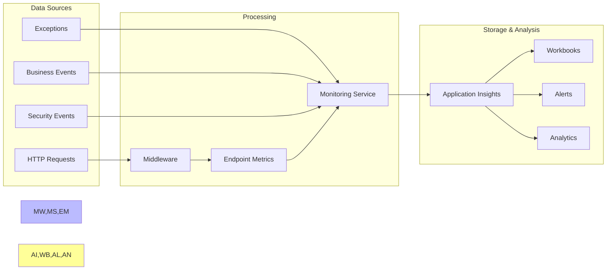

# Azure FastAPI Monitoring Architecture Documentation

  

## Executive Summary

  

The Azure FastAPI project implements a comprehensive monitoring and observability system designed to provide real-time insights into API performance, reliability, and security. The monitoring architecture is built on Azure Application Insights and follows industry best practices for distributed systems observability.

  

### Key Capabilities

- **Real-time Performance Monitoring**: Track API latency, throughput, and error rates

- **Business Metrics Tracking**: Monitor keyword extraction quality and consistency

- **Security Monitoring**: Detect and prevent malicious requests and unauthorized access

- **Client Compatibility Validation**: Ensure Bubble.io API compatibility

- **Automated Health Checks**: Hourly verification of API availability

- **Rich Error Context**: Detailed error tracking with JD previews for debugging

  

### Architecture Highlights

- **Middleware-based**: Centralized monitoring through FastAPI middleware

- **Event-driven**: Custom events for business logic tracking

- **Multi-layered**: Request, application, and infrastructure monitoring

- **Azure-native**: Leverages Application Insights for telemetry storage and analysis

  

---

  

## Architecture Overview

  

### System Components

  

```mermaid

graph TB

subgraph "Client Layer"

C1[Bubble.io App]

C2[API Testing Tools]

C3[Mobile Apps]

C4[Browsers]

end

subgraph "Azure Function App"

subgraph "Middleware Layer"

MW[MonitoringMiddleware]

SEC[SecurityMonitor]

end

subgraph "Core Services"

MS[MonitoringService]

EM[EndpointMetrics]

EF[ErrorFormatting]

RV[ResponseValidator]

end

subgraph "API Endpoints"

EP1[/extract-jd-keywords]

EP2[/health]

EP3[Other Endpoints]

end

end

subgraph "Azure Services"

AI[Application Insights]

KV[Key Vault]

GH[GitHub Actions]

end

C1 --> MW

C2 --> MW

C3 --> MW

C4 --> MW

MW --> SEC

SEC --> MS

MW --> EM

MW --> RV

MW --> EP1

MW --> EP2

MW --> EP3

MS --> AI

EM --> MS

EF --> MS

GH --> EP2

classDef middleware fill:#f9f,stroke:#333,stroke-width:2px

classDef service fill:#bbf,stroke:#333,stroke-width:2px

classDef azure fill:#ff9,stroke:#333,stroke-width:2px

class MW,SEC middleware

class MS,EM,EF,RV service

class AI,KV,GH azure

```

  

### Data Flow Architecture

  



  

---

  

## KPI Standards and Metrics

  

### Performance KPIs

  

| Metric | Target | Current | Monitoring Method |

|--------|--------|---------|-------------------|

| API Availability | 99.9% | Measured | Hourly health checks |

| Response Time (P95) | < 2000ms | Tracked | Request duration metrics |

| Error Rate | < 1% | Calculated | Endpoint error tracking |

| Throughput | 100 req/min | Monitored | Request count metrics |

  

### Business KPIs

  

| Metric | Target | Current | Description |

|--------|--------|---------|-------------|

| Keyword Consistency (Short) | ≥ 70% | 78% | Same keywords for identical JD |

| Keyword Consistency (Long) | ≥ 50% | 60% | Same keywords for identical JD |

| Extraction Success Rate | > 95% | Tracked | Successful extractions |

| Cache Hit Rate | > 30% | Monitored | Cached response usage |

  

### Security KPIs

  

| Metric | Target | Alert Threshold | Action |

|--------|--------|-----------------|--------|

| Suspicious Request Rate | < 0.1% | > 1% | Auto-block IP |

| Invalid Origin Requests | < 0.5% | > 2% | Investigation |

| Rate Limit Violations | < 0.1% | > 0.5% | Temporary block |

| Malicious Pattern Detection | 0% | Any detection | Immediate block |

  

---

  

## Flow Charts

  

### Request Processing Flow

  



  

### Error Handling Flow

  



  

### Monitoring Data Flow

  



  

---

  

## Event Taxonomy

  

### Request Events

  

| Event Name | Description | Key Properties |

|------------|-------------|----------------|

| `RequestStarted` | Fired when request begins | endpoint, method, correlation_id, client_type |

| `RequestTracked` | Fired when request completes | duration_ms, status_code, success |

| `ClientTypeUsage` | Tracks client type distribution | client_type, client_category |

| `BubbleIORequest` | Special tracking for Bubble.io | bubble_compatible, validation_issues |

  

### Business Events

  

| Event Name | Description | Key Properties |

|------------|-------------|----------------|

| `KeywordExtractionStarted` | Extraction begins | language, prompt_version |

| `KeywordExtractionCompleted` | Extraction success | keyword_count, confidence_score |

| `UnsupportedLanguageSkipped` | Non-English/Chinese detected | detected_language, jd_preview |

| `CacheHit` | Cached response used | cache_key, age_seconds |

  

### Error Events

  

| Event Name | Description | Key Properties |

|------------|-------------|----------------|

| `ErrorTracked` | General error tracking | error_type, error_message, jd_preview |

| `ValidationErrorDetails` | Validation failures | primary_error_type, affected_fields |

| `HTTPErrorTracked` | HTTP exceptions | status_code, error_category |

| `ExceptionCategorized` | Unhandled exceptions | exception_type, is_retryable |

  

### Security Events

  

| Event Name | Description | Key Properties |

|------------|-------------|----------------|

| `security_threat_detected` | Malicious pattern found | risk_level, threats, client_ip |

| `security_ip_blocked` | IP temporarily blocked | duration_minutes, reason |

| `request_blocked` | Request rejected | threats, client_ip |

  

### Validation Events

  

| Event Name | Description | Key Properties |

|------------|-------------|----------------|

| `ResponseValidationFailed` | Bubble.io incompatibility | validation_issues, endpoint |

  

---

  

## Best Practices

  

### 1. Correlation ID Management

- **Generate Once**: Create correlation ID at request entry

- **Propagate**: Pass through all service calls

- **Log Everywhere**: Include in all log entries

- **Return to Client**: Add as response header

  

```python

# Example

correlation_id = request.headers.get("X-Correlation-ID", str(uuid.uuid4()))

request.state.correlation_id = correlation_id

```

  

### 2. Error Context Enrichment

- **Capture Request Details**: Method, path, headers

- **Include Business Context**: JD preview for keyword extraction

- **Add Timing Information**: Timestamps and durations

- **Security Context**: Client IP, user agent

  

### 3. Metric Aggregation

- **Real-time Calculation**: Update metrics immediately

- **Hourly Buckets**: Track trends over time

- **Endpoint Grouping**: Aggregate by path and method

- **Error Type Distribution**: Track error patterns

  

### 4. Security Monitoring

- **Pattern Detection**: SQL injection, XSS attempts

- **Rate Limiting**: Per-IP request tracking

- **Origin Validation**: Allowed origins whitelist

- **Automated Response**: Temporary IP blocking

  

### 5. Performance Optimization

- **Async Operations**: Non-blocking telemetry sending

- **Batch Processing**: Group related events

- **Sampling**: Probabilistic sampling for high volume

- **Local Aggregation**: Reduce telemetry volume

  

---

  

## Implementation Guide

  

### 1. Setting Up Monitoring

  

```python

# Initialize monitoring service

monitoring_service = MonitoringService()

  

# Add middleware to FastAPI app

app.add_middleware(MonitoringMiddleware)

  

# Configure Application Insights

APPINSIGHTS_INSTRUMENTATIONKEY = "your-key-here"

```

  

### 2. Tracking Custom Events

  

```python

# Track business event

monitoring_service.track_event(

"KeywordExtractionCompleted",

{

"keyword_count": len(keywords),

"language": language,

"confidence_score": confidence,

"processing_time_ms": duration

}

)

  

# Track custom metric

monitoring_service.track_metric(

"keyword_extraction_consistency",

consistency_score,

{"text_length": "short", "language": "en"}

)

```

  

### 3. Error Tracking with Context

  

```python

# In exception handler

error_context = get_error_context(422, request, exc)

monitoring_service.track_error(

error_type="VALIDATION_ERROR",

error_message=str(exc),

endpoint=f"{request.method} {request.url.path}",

custom_properties={

"jd_preview": jd_text[:100],

**error_context

}

)

```

  

### 4. Security Monitoring

  

```python

# Check request security

security_result = await security_monitor.check_request_security(request)

if security_result["is_blocked"]:

return JSONResponse(status_code=403, content=error_response)

```

  

### 5. Response Validation

  

```python

# Validate Bubble.io compatibility

validation_result = validate_bubble_compatibility(response_body)

if not validation_result["bubble_compatible"]:

monitoring_service.track_event(

"ResponseValidationFailed",

{"issues": validation_result["issues"]}

)

```

  

---

  

## Troubleshooting Guide

  

### Common Issues and Solutions

  

#### 1. Missing Events in Application Insights

**Symptoms**: Events not appearing in Azure Portal

**Solutions**:

- Check instrumentation key configuration

- Verify `monitoring_service.is_enabled` is True

- Ensure `telemetry_client.flush()` is called

- Check network connectivity to Azure

  

#### 2. High Error Rates

**Investigation Steps**:

1. Query error distribution:

```kusto

customEvents

| where name == "ErrorTracked"

| summarize count() by tostring(customDimensions.error_type)

```

2. Check endpoint-specific errors

3. Review recent deployments

4. Analyze error patterns

  

#### 3. Performance Degradation

**Monitoring Queries**:

```kusto

// Slow requests

customEvents

| where name == "RequestTracked"

| where todouble(customDimensions.duration_ms) > 2000

| project timestamp, endpoint, duration_ms

  

// Endpoint performance trends

customEvents

| where name == "endpoint_duration_ms"

| summarize avg(todouble(customDimensions.value)) by tostring(customDimensions.endpoint), bin(timestamp, 1h)

```

  

#### 4. Security Threats

**Detection and Response**:

1. Monitor security events dashboard

2. Review blocked IPs list

3. Analyze threat patterns

4. Update security rules if needed

  

#### 5. Validation Failures

**Debugging Steps**:

1. Check JD preview in error logs

2. Validate request format

3. Test with minimal payload

4. Review field requirements

  

### Monitoring Queries Cheat Sheet

  

```kusto

// Top errors by type

customEvents

| where timestamp > ago(24h)

| where name == "ErrorTracked"

| summarize count() by tostring(customDimensions.error_type)

| order by count_ desc

  

// Unsupported languages with preview

customEvents

| where name == "UnsupportedLanguageSkipped"

| project timestamp,

language = tostring(customDimensions.detected_language),

preview = tostring(customDimensions.jd_preview)

| take 50

  

// Client type distribution

customEvents

| where name == "ClientTypeUsage"

| summarize count() by tostring(customDimensions.client_type)

| render piechart

  

// Endpoint error rates

customMetrics

| where name == "endpoint_error_rate"

| summarize avg(value) by tostring(customDimensions.endpoint)

| where avg_value > 0

| order by avg_value desc

  

// Security threats

customEvents

| where name == "security_threat_detected"

| project timestamp,

ip = tostring(customDimensions.client_ip),

threats = tostring(customDimensions.threats),

risk = tostring(customDimensions.risk_level)

```

  

---

  

## Configuration Reference

  

### Environment Variables

```bash

# Monitoring Configuration

APPINSIGHTS_INSTRUMENTATIONKEY="e62aa619-199c-4f43-826e-bdec26344a26"

MONITORING_ENABLED="true"

  

# Security Configuration

RATE_LIMIT_THRESHOLD="60" # requests per minute

SECURITY_MONITORING_ENABLED="true"

  

# Error Context Configuration

ERROR_CONTEXT_CONFIG__enable_stack_trace="false"

ERROR_CONTEXT_CONFIG__enable_request_body="true"

ERROR_CONTEXT_CONFIG__max_preview_length="200"

```

  

### Application Insights Configuration

```python

# Telemetry sampling

sampler = ProbabilitySampler(1.0) # 100% sampling

  

# Metric aggregation intervals

send_interval_in_milliseconds = 5000 # 5 seconds

max_telemetry_buffer_capacity = 500

  

# Custom dimensions limits

max_property_length = 8192

max_properties_per_event = 200

```

  

---

  

## Future Enhancements

  

### Planned Improvements

1. **Distributed Tracing**: Implement OpenTelemetry for cross-service tracing

2. **Custom Dashboards**: Build role-specific monitoring dashboards

3. **Predictive Analytics**: ML-based anomaly detection

4. **Cost Optimization**: Implement adaptive sampling based on load

5. **Real-time Alerts**: Webhook integrations for critical events

  

### Monitoring Roadmap

- **Q1 2025**: Implement distributed tracing

- **Q2 2025**: Advanced analytics and ML integration

- **Q3 2025**: Multi-region monitoring support

- **Q4 2025**: Full observability platform integration

  

---

  

## References

  

### Documentation

- [Azure Application Insights](https://docs.microsoft.com/en-us/azure/azure-monitor/app/app-insights-overview)

- [FastAPI Middleware](https://fastapi.tiangolo.com/tutorial/middleware/)

- [OpenCensus Python](https://opencensus.io/guides/python/)

  

### Internal Resources

- Monitoring Service: `/src/core/monitoring_service.py`

- Monitoring Middleware: `/src/middleware/monitoring_middleware.py`

- Workbook Configuration: `/azure/monitoring/jd-preview-workbook.json`

  

---

  

**Document Version**: 1.0.0

**Last Updated**: 2025-01-07

**Maintained By**: AI Resume Advisor Team