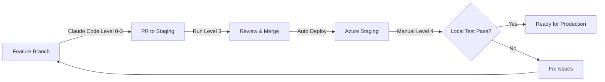

# Staging 部署策略與分支管理

## 概述

本文件描述如何設置 staging 分支，實現自動部署到 Azure Staging 環境，並配置相關的測試流程。

## 分支策略

```
main (production)
  ├── staging (自動部署到 Azure Staging)
  └── feature/* (功能開發分支)
```

### 分支說明

1. **main**: 生產環境分支
   - 自動部署到 Azure Production
   - 只接受來自 staging 的 PR

2. **staging**: 預發布環境分支  
   - 自動部署到 Azure Staging Slot
   - 接受來自 feature 分支的 PR
   - 測試通過後才能合併到 main

3. **feature/***: 功能開發分支
   - 從 staging 分支創建
   - 開發完成後 PR 到 staging

## 實施步驟

### 1. 創建 Staging 分支

```bash
# 從 main 創建 staging 分支
git checkout main
git pull origin main
git checkout -b staging
git push -u origin staging
```

### 2. 設置分支保護規則

在 GitHub 上設置分支保護：

#### Main 分支保護
- Require pull request reviews before merging
- Require status checks to pass (所有測試)
- Require branches to be up to date
- Include administrators
- Restrict who can push to matching branches

#### Staging 分支保護
- Require pull request reviews before merging
- Require status checks to pass (Level 0-3 測試)
- Require branches to be up to date

### 3. GitHub Actions 工作流程

#### A. Staging 部署工作流程 (.github/workflows/deploy-staging.yml)

```yaml
name: Deploy to Azure Staging

on:
  push:
    branches:
      - staging

env:
  AZURE_FUNCTIONAPP_NAME: 'airesumeadvisor-fastapi'
  AZURE_FUNCTIONAPP_PACKAGE_PATH: '.'
  PYTHON_VERSION: '3.11'

jobs:
  test-and-deploy:
    runs-on: ubuntu-latest
    
    steps:
    - name: Checkout code
      uses: actions/checkout@v4

    - name: Setup Python
      uses: actions/setup-python@v5
      with:
        python-version: ${{ env.PYTHON_VERSION }}

    - name: Install dependencies
      run: |
        python -m pip install --upgrade pip
        pip install -r requirements.txt

    - name: Run Level 0-3 Tests
      env:
        AZURE_OPENAI_API_KEY: ${{ secrets.AZURE_OPENAI_API_KEY }}
        LLM2_API_KEY: ${{ secrets.LLM2_API_KEY }}
        GPT41_MINI_JAPANEAST_API_KEY: ${{ secrets.GPT41_MINI_JAPANEAST_API_KEY }}
      run: |
        ./precommit.sh --level-3 --parallel

    - name: Build package
      run: |
        python -m pip install --target=".python_packages/lib/site-packages" -r requirements.txt

    - name: Deploy to Azure Staging Slot
      uses: Azure/functions-action@v1
      with:
        app-name: ${{ env.AZURE_FUNCTIONAPP_NAME }}
        slot-name: 'staging'
        package: ${{ env.AZURE_FUNCTIONAPP_PACKAGE_PATH }}
        publish-profile: ${{ secrets.AZURE_FUNCTIONAPP_STAGING_PUBLISH_PROFILE }}

    - name: Run Post-Deployment Tests
      run: |
        # 等待部署完成
        sleep 30
        
        # 測試 staging slot
        curl -f https://${AZURE_FUNCTIONAPP_NAME}-staging.azurewebsites.net/health || exit 1
        
        # 可以加入更多的 smoke tests
```

#### B. PR 測試工作流程 (.github/workflows/pr-tests.yml)

```yaml
name: PR Tests

on:
  pull_request:
    branches:
      - staging
      - main

jobs:
  test:
    runs-on: ubuntu-latest
    
    steps:
    - name: Checkout code
      uses: actions/checkout@v4

    - name: Setup Python
      uses: actions/setup-python@v5
      with:
        python-version: '3.11'

    - name: Install dependencies
      run: |
        python -m pip install --upgrade pip
        pip install -r requirements.txt

    - name: Run Ruff (Level 1)
      run: |
        ruff check src/ tests/ --exclude=legacy,archive

    - name: Run Unit Tests (Level 2)
      run: |
        python -m pytest tests/unit/ -v

    - name: Run Integration Tests (Level 3)
      if: github.base_ref == 'staging'
      env:
        AZURE_OPENAI_API_KEY: ${{ secrets.AZURE_OPENAI_API_KEY }}
        LLM2_API_KEY: ${{ secrets.LLM2_API_KEY }}
      run: |
        python -m pytest tests/integration/ -v
```

### 4. Pre-commit Hook 設置

#### 安裝 pre-commit
```bash
pip install pre-commit
```

#### 創建 .pre-commit-config.yaml
```yaml
repos:
  - repo: https://github.com/astral-sh/ruff-pre-commit
    rev: v0.1.13
    hooks:
      - id: ruff
        args: [--fix, --exit-non-zero-on-fix]

  - repo: https://github.com/pre-commit/pre-commit-hooks
    rev: v4.5.0
    hooks:
      - id: trailing-whitespace
      - id: end-of-file-fixer
      - id: check-yaml
      - id: check-added-large-files
        args: ['--maxkb=1000']
      - id: check-json
      - id: detect-private-key

  - repo: local
    hooks:
      - id: precommit-tests
        name: Run precommit tests
        entry: bash -c './precommit.sh --level-2 --no-coverage'
        language: system
        pass_filenames: false
        always_run: true
```

#### 安裝 Git Hooks
```bash
pre-commit install
```

### 5. Azure 設置

#### 創建 Staging Slot
```bash
# 創建 staging slot
az functionapp deployment slot create \
  --name airesumeadvisor-fastapi \
  --resource-group airesumeadvisorfastapi \
  --slot staging

# 配置 staging slot 設定
az functionapp config appsettings set \
  --name airesumeadvisor-fastapi \
  --resource-group airesumeadvisorfastapi \
  --slot staging \
  --settings \
    ENVIRONMENT="staging" \
    # 複製所有必要的環境變數
```

#### 獲取 Staging Publish Profile
1. 登入 Azure Portal
2. 前往 Function App > Deployment slots
3. 選擇 staging slot
4. Download publish profile
5. 將內容加入 GitHub Secrets: `AZURE_FUNCTIONAPP_STAGING_PUBLISH_PROFILE`

### 6. 開發流程



### 7. 測試層級對應（根據 CLAUDE.md）

| 階段 | 測試層級 | 說明 |
|------|---------|------|
| Claude Code 開發 | Level 0-3 | 根據修改範圍決定層級（CLAUDE.md 要求） |
| PR to Staging | Level 3 | 整合測試（確保 API 功能正常） |
| Merge to Staging | 自動部署 | Push/Merge 後立即部署到 Azure Staging |
| 手動驗證 | Level 4 | 開發者在本地執行 Azure Functions 測試 |

**注意**：
- Claude Code 必須根據修改類型執行對應層級測試（見 CLAUDE.md 測試分級策略）
- Merge/Push to Staging 會自動觸發部署到 Azure Staging Slot
- Level 4 為開發者手動在本地執行，用於驗證部署後的功能
- PR to Main 暫不實施

## 使用範例

### 開發新功能
```bash
# 1. 從 staging 創建功能分支
git checkout staging
git pull origin staging
git checkout -b feature/new-feature

# 2. Claude Code 開發（執行 Level 0-3 測試）
# 根據修改範圍執行適當測試

# 3. 推送並創建 PR
git push origin feature/new-feature
# 在 GitHub 上創建 PR 到 staging

# 4. PR 通過 Level 3 測試後合併
# 5. 合併後自動部署到 Azure Staging

# 6. 開發者手動執行 Level 4 測試（本地）
./precommit.sh --level-4

# 7. 驗證通過後，準備發布到生產環境
```

### 緊急修復
```bash
# 1. 從 main 創建 hotfix 分支
git checkout main
git checkout -b hotfix/urgent-fix

# 2. 修復並測試
./precommit.sh --level-3

# 3. PR 到 staging 先測試
# 4. 測試通過後 PR 到 main
```

## Claude Code 測試要求（重要！）

根據 CLAUDE.md 規定，Claude Code 必須：

1. **根據修改範圍執行對應層級測試**
   - Level 0: Prompt 修改
   - Level 1: 程式碼風格
   - Level 2: 單元測試（功能修改）
   - Level 3: 整合測試（API/核心修改）

2. **測試全部通過才能回報完成**

3. **Level 4 為手動測試**，不在 Claude Code 執行範圍

## 監控與日誌

### Staging 環境監控
```bash
# 查看 staging slot 日誌
az functionapp log tail \
  --name airesumeadvisor-fastapi \
  --resource-group airesumeadvisorfastapi \
  --slot staging

# 查看 staging slot metrics
az monitor metrics list \
  --resource /subscriptions/{subscription-id}/resourceGroups/airesumeadvisorfastapi/providers/Microsoft.Web/sites/airesumeadvisor-fastapi/slots/staging \
  --metric "Http5xx"
```

## 注意事項

1. **環境變數**: 確保 staging 和 production 使用不同的 API keys
2. **資料庫**: Staging 應使用獨立的測試資料庫
3. **成本控制**: Staging slot 會產生額外費用，可考慮按需開關
4. **測試覆蓋**: PR 到 main 時應有更嚴格的測試要求

## 相關文件

- [Pre-commit 官方文檔](https://pre-commit.com/)
- [Azure Functions Deployment Slots](https://docs.microsoft.com/en-us/azure/azure-functions/functions-deployment-slots)
- [GitHub Actions for Azure](https://github.com/Azure/functions-action)