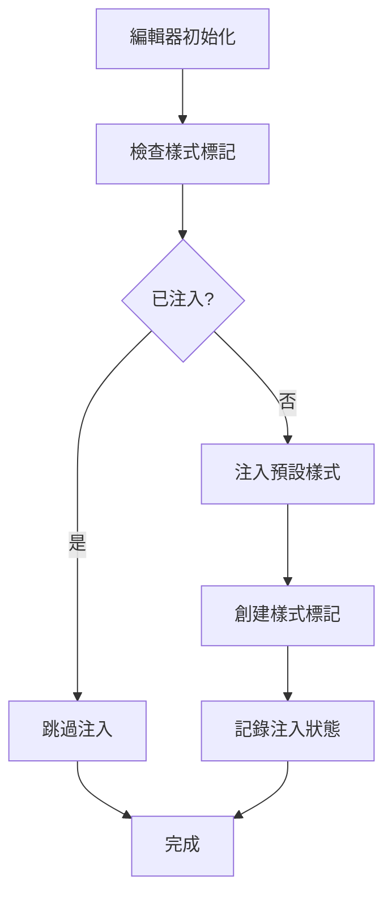
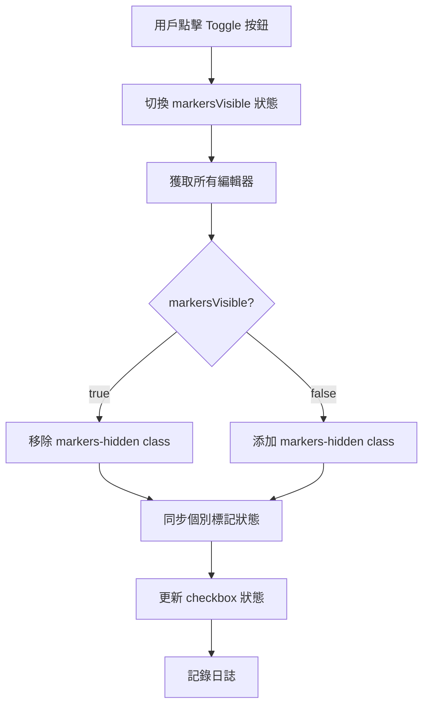
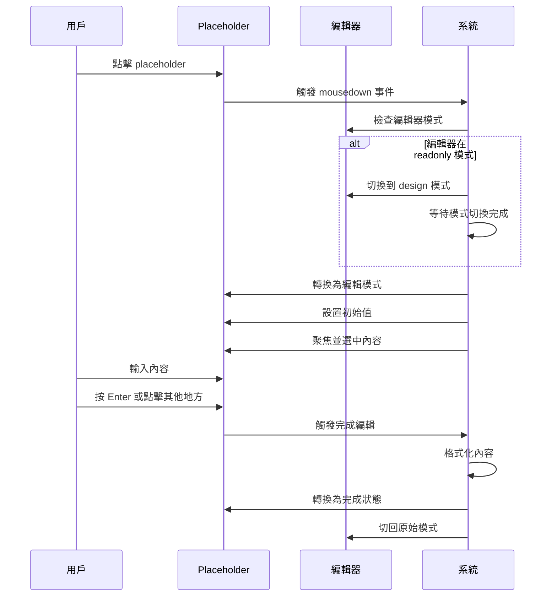

# 系統架構說明

## 🏗️ 整體架構

TinyMCE 多編輯器標記控制系統採用模組化設計，包含以下核心組件：

```
┌─────────────────────────────────────────────────────────┐
│                   Bubble.io Page                        │
├─────────────────────────────────────────────────────────┤
│  Page HTML Header                                       │
│  ├── CSS Styles (標記樣式定義)                           │
│  ├── Global State Management (全局狀態管理)              │
│  ├── Multi-Editor Support (多編輯器支援)                 │
│  ├── Style Injection System (樣式注入系統)               │
│  └── Diagnostic Tools (診斷工具)                         │
├─────────────────────────────────────────────────────────┤
│  Page Loaded Workflow                                   │
│  └── TinyMCE Placeholder Handler (Placeholder 處理器)    │
├─────────────────────────────────────────────────────────┤
│  UI Controls (使用者介面控制)                             │
│  ├── Toggle Button (主開關按鈕)                          │
│  └── Individual Checkboxes (個別標記控制)                │
├─────────────────────────────────────────────────────────┤
│  TinyMCE Editors (編輯器實例)                            │
│  ├── Editor 1 (編輯器 1)                                 │
│  ├── Editor 2 (編輯器 2)                                 │
│  └── ... (更多編輯器)                                    │
└─────────────────────────────────────────────────────────┘
```

## 🔧 核心組件

### 1. 全局狀態管理 (Global State Management)

**位置**: Page HTML Header  
**職責**: 管理所有標記的顯示狀態

```javascript
// 主要狀態變數
window.markersVisible = true;              // 主開關
window.tagVisibility = {                   // 個別標記狀態
    'opt-keyword': true,
    'opt-keyword-existing': true,
    'opt-modified': true,
    'opt-new': true,
    'opt-placeholder': true
};
```

**關鍵特性**：
- 單一數據源 (Single Source of Truth)
- 狀態同步機制
- 向後相容性

### 2. 多編輯器支援系統 (Multi-Editor Support)

**核心函數**: `getAllTinyMCEEditors()`, `forEachEditor()`

```javascript
function forEachEditor(callback) {
    const editors = getAllTinyMCEEditors();
    editors.forEach((editor, index) => {
        if (editor && editor.initialized) {
            try {
                callback(editor, index);
            } catch (e) {
                console.error(`Error processing editor ${editor.id}:`, e);
            }
        }
    });
}
```

**特性**：
- 自動偵測所有編輯器實例
- 統一操作介面
- 錯誤隔離（單個編輯器錯誤不影響其他編輯器）

### 3. 樣式注入系統 (Style Injection System)

**主要函數**: `injectDefaultMarkerStyles()`, `injectMultiTagStyles()`



**設計原則**：
- 避免重複注入
- 樣式隔離（每個編輯器獨立）
- 動態樣式管理

### 4. 新編輯器監控系統 (New Editor Monitoring)

```javascript
function monitorNewEditors() {
    const processedEditors = new Set();
    
    function checkForNewEditors() {
        const editors = getAllTinyMCEEditors();
        editors.forEach(editor => {
            if (!processedEditors.has(editor.id) && editor.initialized) {
                // 處理新編輯器
                processedEditors.add(editor.id);
                setupNewEditor(editor);
            }
        });
    }
    
    setInterval(checkForNewEditors, 2500);
}
```

**監控機制**：
- 定期掃描 (2.5 秒間隔)
- 事件監聽 (TinyMCE AddEditor 事件)
- 狀態追蹤 (已處理編輯器記錄)

## 🎯 標記控制流程

### 1. 主開關控制流程



### 2. 個別標記控制流程

```mermaid
graph TD
    A[用戶點擊 Checkbox] --> B{主開關開啟?}
    B -->|否| C[顯示警告並返回]
    B -->|是| D[切換標記狀態]
    D --> E[更新 tagVisibility]
    E --> F[獲取所有編輯器]
    F --> G[應用 hide-{tagType} class]
    G --> H[更新 checkbox 視覺狀態]
    H --> I[記錄日誌]
```

## 📝 Placeholder 編輯系統

### 架構設計

```
┌─────────────────────────────────────────────────┐
│              Placeholder 編輯器                   │
├─────────────────────────────────────────────────┤
│  事件監聽層 (Event Listeners)                     │
│  ├── mousedown (capture phase)                  │
│  ├── keydown (Enter/Escape)                     │
│  └── focus/blur                                 │
├─────────────────────────────────────────────────┤
│  狀態管理層 (State Management)                    │
│  ├── activeInput (當前編輯元素)                    │
│  ├── placeholderData (編輯資料)                   │
│  ├── originalMode (原始模式)                      │
│  └── hasClickedBefore (第一次點擊標記)             │
├─────────────────────────────────────────────────┤
│  模式切換層 (Mode Switching)                      │
│  ├── readonly → design                          │
│  ├── 等待機制 (waitForModeChange)                 │
│  └── design → readonly                          │
├─────────────────────────────────────────────────┤
│  格式化層 (Formatting Layer)                      │
│  ├── 類型檢測 (Type Detection)                    │
│  ├── 單位添加 (Unit Addition)                     │
│  └── 樣式轉換 (Style Conversion)                  │
└─────────────────────────────────────────────────┘
```

### 編輯流程



## 🔄 同步機制

### 狀態同步架構

```
┌──────────────────┐    ┌──────────────────┐    ┌──────────────────┐
│   主開關狀態       │    │   個別標記狀態     │    │   UI 控制狀態      │
│                  │    │                  │    │                  │
│ markersVisible   │◄──►│ tagVisibility    │◄──►│ Checkbox States  │
│                  │    │                  │    │                  │
└──────────────────┘    └──────────────────┘    └──────────────────┘
           │                       │                       │
           ▼                       ▼                       ▼
┌──────────────────────────────────────────────────────────────────┐
│                    編輯器 DOM 狀態                                 │
│                                                                  │
│  Editor 1: markers-hidden, hide-opt-*                          │
│  Editor 2: markers-hidden, hide-opt-*                          │
│  Editor N: markers-hidden, hide-opt-*                          │
└──────────────────────────────────────────────────────────────────┘
```

### 同步觸發點

1. **主開關切換時**
   - 同步所有個別標記狀態
   - 更新所有編輯器 DOM
   - 更新所有 checkbox

2. **個別標記切換時**
   - 檢查主開關狀態
   - 更新對應編輯器 DOM
   - 更新對應 checkbox

3. **新編輯器加入時**
   - 應用當前主開關狀態
   - 應用所有個別標記狀態
   - 注入必要樣式

## 🛡️ 錯誤處理架構

### 多層次錯誤處理

```
┌─────────────────────────────────────────────┐
│              應用層錯誤處理                   │
│  ├── 用戶操作錯誤 (User Action Errors)        │
│  ├── 狀態不一致錯誤 (State Inconsistencies)   │
│  └── UI 同步錯誤 (UI Sync Errors)            │
├─────────────────────────────────────────────┤
│              編輯器層錯誤處理                 │
│  ├── 編輯器未初始化 (Editor Not Initialized)  │
│  ├── DOM 操作錯誤 (DOM Operation Errors)     │
│  └── 事件處理錯誤 (Event Handler Errors)     │
├─────────────────────────────────────────────┤
│              系統層錯誤處理                   │
│  ├── TinyMCE 未載入 (TinyMCE Not Loaded)     │
│  ├── 函數不存在 (Function Not Found)         │
│  └── 瀏覽器相容性 (Browser Compatibility)     │
└─────────────────────────────────────────────┘
```

### 錯誤恢復策略

1. **自動重試**
   ```javascript
   // 模式切換重試機制
   function waitForModeChange(editor, targetMode, callback) {
       let attempts = 0;
       const maxAttempts = 20;
       // ... 重試邏輯
   }
   ```

2. **降級處理**
   ```javascript
   // 編輯器操作降級
   forEachEditor(function(editor, index) {
       try {
           // 正常操作
       } catch (e) {
           console.error(`Editor ${index} error:`, e);
           // 繼續處理其他編輯器
       }
   });
   ```

3. **狀態重置**
   ```javascript
   // 緊急狀態重置
   window.resetAllMarkerStates = function() {
       // 重置所有狀態為安全值
   };
   ```

## 📊 性能優化設計

### 1. 樣式注入優化

- **避免重複注入**: 使用標記元素檢查
- **按需注入**: 只在編輯器初始化時注入
- **樣式緩存**: 複用樣式規則

### 2. 事件處理優化

- **事件委託**: 使用 capture phase 減少事件監聽器數量
- **防抖動**: 避免頻繁的狀態更新
- **異步處理**: 非關鍵操作使用 setTimeout

### 3. DOM 操作優化

- **批量操作**: 一次性處理多個編輯器
- **最小化重繪**: 只修改必要的 CSS class
- **狀態檢查**: 避免不必要的 DOM 操作

## 🔧 擴展架構

### 新標記類型添加

1. **樣式定義** (Page Header)
2. **狀態管理** (tagVisibility)
3. **控制邏輯** (Checkbox workflow)
4. **樣式注入** (CSS rules)

### 新功能模組添加

```javascript
// 模組化設計範例
const MarkerControlModule = {
    init: function() {
        this.setupEventListeners();
        this.injectStyles();
        this.startMonitoring();
    },
    
    setupEventListeners: function() {
        // 事件監聽設置
    },
    
    injectStyles: function() {
        // 樣式注入
    },
    
    startMonitoring: function() {
        // 監控啟動
    }
};
```

## 🎯 設計原則

1. **單一職責**: 每個函數只負責一個特定功能
2. **開放封閉**: 對擴展開放，對修改封閉
3. **依賴反轉**: 依賴抽象而非具體實現
4. **最小知識**: 模組間最小化耦合
5. **容錯設計**: 單點故障不影響整個系統

這個架構設計確保了系統的可維護性、可擴展性和穩定性，同時提供了完整的錯誤處理和性能優化機制。