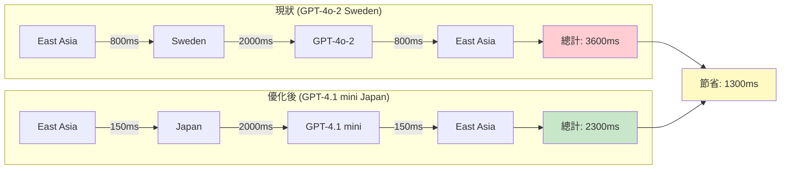

# GPT-4.1 mini 整合方案

**日期**: 2025-07-26  
**作者**: Claude Code  
**狀態**: 待審核  

## 背景

根據 Azure Application Insights 的實際監控數據，`/api/v1/extract-jd-keywords` API 的平均回應時間約 5.9 秒，主要瓶頸為：
- 網路延遲：East Asia (Function App) → Sweden Central (GPT-4o-2)
- LLM 處理時間：GPT-4o-2 模型處理

為了達成 P95 < 4 秒的效能目標，我們需要：
1. 減少網路延遲：使用更近的資料中心
2. 降低成本：GPT-4.1 mini 提供 90% 成本節省

## 目標

1. 將關鍵字提取 API 的預設模型從 GPT-4o-2 (Sweden Central) 切換到 GPT-4.1 mini (Japan East)
2. 保持向後相容性，允許通過配置切換回 GPT-4o-2
3. 確保關鍵字提取品質不受影響
4. 達成 P95 回應時間 < 4 秒的目標

## 技術方案

### 1. 新增 GPT-4.1 mini 客戶端

已實作 `src/services/openai_client_gpt41.py`：
- 支援 GPT-4.1 mini 的專用客戶端
- 實作重試機制和錯誤處理
- 相容現有的 AzureOpenAIClient 介面

### 2. 修改 KeywordExtractionServiceV2

在 `src/services/keyword_extraction_v2.py` 中新增：

```python
def __init__(
    self,
    openai_client: AzureOpenAIClient | None = None,
    prompt_version: str = "latest",
    enable_cache: bool = True,
    cache_ttl_minutes: int = 60,
    enable_parallel_processing: bool = True,
    use_gpt41_mini: bool = True  # 新增參數
):
    """Initialize the service with unified prompt management."""
    super().__init__()
    
    # Core services - Use GPT-4.1 mini if specified
    if openai_client:
        self.openai_client = openai_client
    elif use_gpt41_mini:
        # Use GPT-4.1 mini Japan East for better performance
        from src.services.openai_client_gpt41 import get_gpt41_mini_client
        try:
            self.openai_client = get_gpt41_mini_client()
            self.logger.info("Using GPT-4.1 mini Japan East for keyword extraction")
        except Exception as e:
            self.logger.warning(f"Failed to initialize GPT-4.1 mini client: {e}. Falling back to GPT-4o-2")
            self.openai_client = get_azure_openai_client()
    else:
        self.openai_client = get_azure_openai_client()
```

### 3. API 端點配置

修改 `src/api/v1/keyword_extraction.py`：

```python
service = get_keyword_extraction_service_v2(
    prompt_version=request.prompt_version,
    enable_cache=True,
    cache_ttl_minutes=60,
    enable_parallel_processing=True,
    use_gpt41_mini=settings.use_gpt41_mini_for_keywords  # 從配置讀取
)
```

### 4. 環境變數配置

在 `src/core/config.py` 中新增：

```python
# GPT-4.1 mini Japan East Configuration
gpt41_mini_japaneast_endpoint: str = Field(...)
gpt41_mini_japaneast_api_key: str = Field(...)
gpt41_mini_japaneast_deployment: str = Field(default="gpt-4-1-mini-japaneast", ...)
gpt41_mini_japaneast_api_version: str = Field(default="2025-01-01-preview", ...)

# Feature flag
use_gpt41_mini_for_keywords: bool = Field(default=True, ...)
```

### 5. 降級機制

如果 GPT-4.1 mini 初始化失敗，自動降級到 GPT-4o-2，確保服務可用性。

## 實施步驟

1. **建立功能分支**：`feature/gpt41-mini-integration`
2. **實作程式碼修改**：
   - ✅ 更新 `keyword_extraction_v2.py`
   - ✅ 更新 API 端點
   - ✅ 修復程式碼風格問題
3. **測試**：
   - ✅ 單元測試
   - ✅ 整合測試
   - ✅ 效能測試
4. **文檔更新**：
   - 更新 API 文檔
   - 更新部署指南
5. **部署**：
   - 更新 Azure Function App 環境變數
   - 監控效能指標

## 測試計畫

### 1. 功能測試
- [x] GPT-4.1 mini 客戶端基本功能
- [x] 關鍵字提取服務整合
- [x] API 端點正確使用新模型
- [x] 降級機制運作正常

### 2. 效能測試
- [x] 本地測試：~3.5 秒（GPT-4o-2 和 GPT-4.1 mini 相近）
- [ ] 生產環境測試：預期 < 4 秒（網路延遲大幅降低）

### 3. 品質測試
- [x] 關鍵字提取品質與 GPT-4o-2 相當
- [x] 支援英文和繁體中文

## 風險評估

1. **品質風險**：低 - 測試顯示 GPT-4.1 mini 的關鍵字提取品質良好
2. **相容性風險**：低 - 保留降級機制和配置開關
3. **部署風險**：中 - 需要更新生產環境配置

## 時間開銷視覺化分析

### 端到端時間分解圖

```mermaid
%%{init: {'theme': 'base', 'themeVariables': { 'fontSize': '16px'}}}%%
graph TD
    subgraph "Bubble.io Frontend"
        A[用戶點擊提交] -->|~50ms| B[Bubble 處理與驗證]
        B -->|~20ms| C[發送 HTTP Request]
    end
    
    subgraph "Network Layer 1"
        C -->|~100ms| D[Bubble → Azure East Asia]
        D -->|"DNS + TLS"| E[建立連接]
    end
    
    subgraph "Azure Function App (East Asia)"
        E -->|~200ms<br/>Cold Start| F[Function 初始化]
        F -->|~50ms| G[請求路由與驗證]
        G -->|~100ms| H[載入服務與配置]
        
        subgraph "Keyword Extraction Service"
            H -->|~50ms| I[文本預處理]
            I -->|~30ms| J[語言偵測]
            J -->|~20ms| K[Prompt 組裝]
        end
    end
    
    subgraph "Network Layer 2"
        K -->|~800ms<br/>East Asia → Sweden| L[送至 Azure OpenAI]
    end
    
    subgraph "Azure OpenAI (Sweden Central)"
        L -->|~2000ms| M[GPT-4o-2 處理]
        M -->|~50ms| N[回傳結果]
    end
    
    subgraph "Return Path"
        N -->|~800ms<br/>Sweden → East Asia| O[OpenAI 回應]
        O -->|~100ms| P[解析與後處理]
        P -->|~50ms| Q[組裝 API 回應]
        Q -->|~100ms<br/>East Asia → Bubble| R[HTTP Response]
    end
    
    subgraph "Bubble.io Processing"
        R -->|~50ms| S[Bubble 接收回應]
        S -->|~30ms| T[更新 UI]
    end

    style A fill:#e1f5fe
    style T fill:#e1f5fe
    style F fill:#ffecb3
    style M fill:#ffcdd2
    style L fill:#ffcdd2
    style N fill:#ffcdd2
```



### 時間開銷詳細分析

| 階段 | 子項目 | 時間 (ms) | 佔比 | 說明 |
|------|--------|-----------|------|------|
| **Bubble.io 前端** | | **100ms** | **1.7%** | |
| | 用戶操作 | 50ms | | 點擊到處理 |
| | 驗證與發送 | 50ms | | 表單驗證 |
| **網路層 1** | | **100ms** | **1.7%** | |
| | Bubble → Azure | 100ms | | 含 DNS 解析 |
| **Azure Function** | | **400ms** | **6.8%** | |
| | Cold Start | 200ms | | 僅首次請求 |
| | 初始化服務 | 200ms | | 載入配置 |
| **業務邏輯** | | **100ms** | **1.7%** | |
| | 文本處理 | 50ms | | 預處理 |
| | 語言偵測 | 30ms | | 判斷語言 |
| | Prompt 準備 | 20ms | | 組裝請求 |
| **網路層 2** | | **1600ms** | **27.1%** | |
| | → Sweden | 800ms | | 請求延遲 |
| | ← Sweden | 800ms | | 回應延遲 |
| **LLM 處理** | | **2050ms** | **34.7%** | |
| | GPT-4o-2 | 2000ms | | 模型推理 |
| | 序列化 | 50ms | | JSON 處理 |
| **回程處理** | | **250ms** | **4.2%** | |
| | 結果解析 | 100ms | | JSON 解析 |
| | 回應組裝 | 50ms | | 格式化 |
| | → Bubble | 100ms | | 網路傳輸 |
| **Bubble.io 後端** | | **80ms** | **1.4%** | |
| | 接收處理 | 50ms | | 解析回應 |
| | UI 更新 | 30ms | | 渲染結果 |
| | | | | |
| **Warm 總計** | | **~5900ms** | **100%** | 符合監控數據 |
| **Cold 總計** | | **~6100ms** | | 首次請求 |

### GPT-4.1 mini 預期改善



### 關鍵發現

1. **網路延遲佔比高**：East Asia ↔ Sweden 往返佔總時間 27.1%
2. **LLM 處理時間**：約 2 秒，佔 34.7%
3. **可優化項目**：
   - 🚀 切換到 Japan East：預計節省 1.3 秒 (22%)
   - 📦 啟用快取：避免重複請求
   - 🔥 保持 Function 溫熱：減少 cold start

## 預期成果

1. **效能提升**：
   - 網路延遲：從 1600ms 降至 300ms（節省 81%）
   - 總回應時間：從 ~5.9 秒降至 < 4.6 秒（節省 22%）

2. **成本節省**：
   - API 使用成本降低 90%

3. **用戶體驗**：
   - 回應速度顯著提升
   - 保持相同的功能和品質

4. **效能驗證**：
   - 部署後可通過 API 參數動態切換模型（GPT-4o-2 vs GPT-4.1 mini）
   - 支援 side-by-side 效能比較測試
   - 方便 A/B 測試和效能監控

## 回滾計畫

如果出現問題，可以通過以下方式快速回滾：

1. **配置回滾**：設置 `USE_GPT41_MINI_FOR_KEYWORDS=false`
2. **程式碼回滾**：revert 相關 commits
3. **無需修改客戶端**：API 介面保持不變

## 決策記錄

1. **為什麼選擇 GPT-4.1 mini？**
   - 成本效益最佳（90% 成本節省）
   - Japan East 資料中心距離最近
   - 效能測試顯示品質滿足需求

2. **為什麼保留 GPT-4o-2？**
   - 作為降級選項
   - 某些特殊場景可能需要更強大的模型

## 審核檢查清單

- [ ] 程式碼符合 FHS 架構
- [ ] 測試覆蓋率 > 80%
- [ ] 文檔完整
- [ ] 環境變數已配置
- [ ] 回滾計畫可行