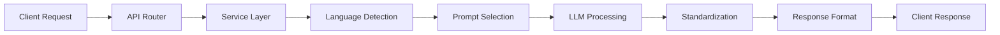

# FHS (Functional Hierarchy Structure) Architecture

## Overview
This project follows the FHS architecture pattern, organizing code by functional domains rather than technical layers.

## Architecture Principles

### 1. Functional Organization
```
src/
├── api/                    # API endpoints (presentation layer)
│   └── v1/                # Version 1 endpoints
├── services/              # Business logic layer
│   ├── keyword_extraction/
│   ├── language_detection/
│   └── standardization/
├── core/                  # Core functionality
│   ├── config.py         # Configuration
│   ├── monitoring_service.py
│   └── monitoring/
├── models/               # Data models
├── middleware/          # Cross-cutting concerns
└── utils/              # Utility functions
```

### 2. Key Components

#### API Layer (`src/api/`)
- FastAPI routers
- Request/response handling
- Input validation
- Error formatting

#### Services Layer (`src/services/`)
- **KeywordExtractionServiceV2**: Main extraction logic
- **UnifiedPromptService**: Multi-language prompt management
- **SimpleLanguageDetector**: Language detection
- **KeywordStandardizer**: Terminology standardization

#### Core Layer (`src/core/`)
- **MonitoringService**: Application Insights integration
- **Configuration**: Environment-based settings
- **Security**: Request validation and threat detection

#### Models Layer (`src/models/`)
- Pydantic models for data validation
- Unified response format
- Bubble.io compatibility

#### Middleware Layer (`src/middleware/`)
- **MonitoringMiddleware**: Request/response tracking
- Performance timing
- Correlation ID management
- Security checks

### 3. Design Patterns

#### Service Pattern
```python
class KeywordExtractionServiceV2:
    def __init__(self, prompt_service, language_detector, standardizer):
        self.prompt_service = prompt_service
        self.language_detector = language_detector
        self.standardizer = standardizer
    
    async def process(self, data: KeywordExtractionData):
        # Business logic implementation
        pass
```

#### Dependency Injection
```python
def get_keyword_extraction_service_v2(
    prompt_version: str = "latest",
    enable_cache: bool = True
) -> KeywordExtractionServiceV2:
    # Service factory with dependencies
    pass
```

#### Unified Response Pattern
```python
@dataclass
class UnifiedResponse:
    success: bool
    data: Any
    error: ErrorDetail
    timestamp: datetime
```

### 4. Data Flow



### 5. Key Features

#### Parallel Processing
- 2-round intersection strategy
- Concurrent LLM calls
- Result aggregation

#### Caching Strategy
- In-memory cache with TTL
- Request hash-based keys
- Cache invalidation on prompt updates

#### Error Handling
- Layered error catching
- Context preservation
- Graceful degradation

### 6. Integration Points

#### Azure OpenAI
- Endpoint configuration
- API key management
- Request formatting

#### Application Insights
- Custom event tracking
- Performance metrics
- Error logging

#### Azure Functions
- ASGI adapter
- Function triggers
- Environment configuration

### 7. Scalability Considerations

#### Horizontal Scaling
- Stateless services
- External cache (Redis ready)
- Load balancing support

#### Performance Optimization
- Request batching
- Connection pooling
- Async/await throughout

### 8. Security Architecture

#### Request Validation
- Input sanitization
- Size limits
- Pattern detection

#### Rate Limiting
- Per-IP tracking
- Sliding window
- Automatic blocking

#### Authentication
- Function key validation
- Origin checking
- User agent analysis

---

**Version**: 1.0  
**Last Updated**: 2025-01-07  
**Architecture Pattern**: FHS (Functional Hierarchy Structure)