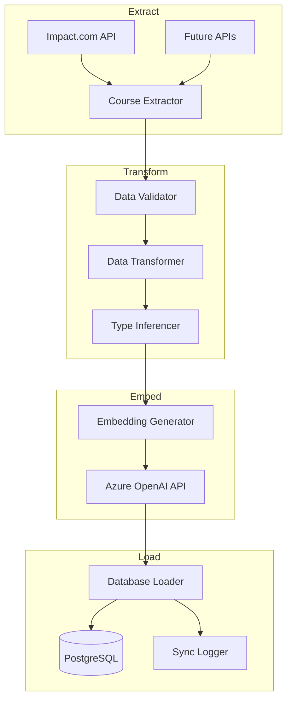

# Coursera 資料庫與 ETL 設計規格書

**版本**: 2.0 (整合版)  
**日期**: 2025-07-15  
**狀態**: 已實作

> 📌 **快速參考**：如只需查詢資料庫欄位定義，請參考 [DATABASE_DESIGN_COURSES_20250715.md](./DATABASE_DESIGN_COURSES_20250715.md)

## 1. 概述

本文檔整合了課程推薦系統的資料庫架構設計與 ETL 管線實作。此文檔取代先前的多個分散文檔。

### 1.1 文檔歷史
- 整合自：
  - DESIGN_COURSE_DATABASE_SCHEMA_20250714.md
  - DESIGN_ETL_PIPELINE_20250714.md  
  - DATABASE_DESIGN_COURSES_20250715.md
- 原因：消除重複內容，維持單一事實來源

### 1.2 主要需求
- 支援多個課程平台（優先支援 Coursera）
- 儲存課程資訊與聯盟行銷連結
- 啟用向量語意搜尋（pgvector）
- 追蹤搜尋行為與同步狀態
- 自動化 ETL 管線進行資料更新

### 1.3 技術架構
- 資料庫：PostgreSQL 15 with pgvector extension
- 向量維度：1536（OpenAI text-embedding-3-small）
- 主機：Azure Database for PostgreSQL Flexible Server
- ETL：基於 Python 的非同步管線

### 1.4 API 資料來源
- **Impact.com Publisher API**: https://integrations.impact.com/impact-publisher/
- 用於獲取 Coursera 課程目錄、價格、聯盟行銷連結等資訊

## 2. 資料庫架構（最終實作）

### 2.1 courses 資料表（核心表）

在單一資料表中儲存所有課程詳細資訊（包含向量），以達到最佳效能。

```sql
CREATE TABLE courses (
    -- ===== 識別欄位 =====
    id VARCHAR(255) PRIMARY KEY,              -- 格式: {platform}_{external_id}
    platform VARCHAR(50) NOT NULL,            -- 平台: 'coursera', 'udemy', 'edx'
    external_id VARCHAR(255) NOT NULL,        -- 原始 ID (如: spzn:xxx, crse:xxx)
    
    -- ===== 基本資訊 (來自 Impact.com API) =====
    name TEXT NOT NULL,                       -- 課程標題
    description TEXT,                         -- 課程描述
    provider VARCHAR(500),                    -- 提供者 (IBM, Google, Stanford)
    course_type VARCHAR(50),                  -- 類型: course/specialization/certificate
    
    -- ===== 技能與分類 =====
    skills TEXT[],                           -- 技能陣列
    category VARCHAR(500),                    -- 主分類
    
    -- ===== 商業資訊 =====
    price DECIMAL(10,2) DEFAULT 0,           -- 現價 (美元)
    currency VARCHAR(10) DEFAULT 'USD',       -- 貨幣代碼
    image_url TEXT,                          -- 課程圖片網址
    affiliate_url TEXT NOT NULL,             -- Impact.com 聯盟追蹤連結
    
    -- ===== 學習資訊 (待擴充) =====
    duration_hours INT,                      -- 預估時數
    difficulty_level VARCHAR(20),            -- beginner/intermediate/advanced
    rating DECIMAL(2,1),                     -- 平均評分 (如: 4.8)
    ratings_count INT,                       -- 評分人數
    enrolled_count INT,                      -- 註冊人數
    
    -- ===== 向量資料 =====
    embedding vector(1536),                  -- 語意搜尋向量
    
    -- ===== 時間戳記 =====
    created_at TIMESTAMP DEFAULT CURRENT_TIMESTAMP,
    updated_at TIMESTAMP DEFAULT CURRENT_TIMESTAMP,
    
    -- ===== 彈性儲存 =====
    metadata JSONB,                          -- 額外資訊
    
    -- ===== 約束條件 =====
    UNIQUE(platform, external_id)
);

-- 效能優化索引
CREATE INDEX idx_courses_platform ON courses(platform);
CREATE INDEX idx_courses_provider ON courses(provider);
CREATE INDEX idx_courses_price ON courses(price);
CREATE INDEX idx_courses_type ON courses(course_type);
CREATE INDEX idx_courses_platform_type ON courses(platform, course_type);
```

### 2.2 search_logs 資料表

記錄使用者搜尋行為以供分析。

```sql
CREATE TABLE search_logs (
    id SERIAL PRIMARY KEY,
    query TEXT NOT NULL,
    results_count INT DEFAULT 0,
    response_time_ms INT,
    created_at TIMESTAMP DEFAULT CURRENT_TIMESTAMP
);
```

### 2.3 sync_logs 資料表

追蹤 ETL 同步狀態。

```sql
CREATE TABLE sync_logs (
    id SERIAL PRIMARY KEY,
    sync_type VARCHAR(50) NOT NULL,          -- 'full' 或 'incremental'
    platform VARCHAR(50),
    total_processed INT DEFAULT 0,
    new_courses INT DEFAULT 0,
    updated_courses INT DEFAULT 0,
    status VARCHAR(50) NOT NULL,             -- 'running', 'completed', 'failed'
    error_message TEXT,
    started_at TIMESTAMP DEFAULT CURRENT_TIMESTAMP,
    completed_at TIMESTAMP
);
```

## 3. ETL 管線架構



## 4. ETL 實作細節

### 4.1 課程類型推斷

```python
def infer_course_type(external_id: str, name: str = '') -> str:
    """從 ID 和名稱推斷課程類型"""
    name_lower = name.lower()
    
    # 先檢查名稱（最可靠）
    if 'professional certificate' in name_lower:
        return 'professional-certificate'
    elif 'guided project' in name_lower:
        return 'project'
    elif 'degree' in name_lower:
        return 'degree'
    
    # 再檢查 ID 前綴
    if external_id.startswith('crse:'):
        return 'course'
    elif external_id.startswith('spzn:'):
        return 'specialization'
    elif external_id.startswith('proj:'):
        return 'project'
    elif external_id.startswith('cert:'):
        return 'certificate'
    
    return 'course'  # 預設值
```

### 4.2 嵌入向量文本生成

```python
def create_embedding_text(course: Dict[str, Any]) -> str:
    """建立最佳化的嵌入向量生成文本"""
    parts = [
        f"Course: {course['name']}",
        f"Provider: {course['provider']}",
        f"Type: {course['course_type']}",
    ]
    
    if course.get('skills'):
        parts.append(f"Skills: {', '.join(course['skills'][:10])}")
    
    if course.get('category'):
        parts.append(f"Category: {course['category']}")
    
    # 限制描述長度以優化 token 使用
    desc = course.get('description', '')
    if desc:
        parts.append(f"Description: {desc[:1500]}")
    
    return " | ".join(parts)
```

### 4.3 ETL 階段

#### 階段 1：擷取（Extract）
- 連接 Impact.com API
- 分頁瀏覽目錄項目
- 擷取所有可用欄位
- 處理速率限制

#### 階段 2：轉換（Transform）
- 清理描述中的 HTML
- 推斷課程類型
- 標準化資料格式
- 從 metadata 擷取技能

#### 階段 3：生成嵌入向量（Generate Embeddings）
- 批次處理課程（每批 16 個）
- 生成嵌入向量文本
- 呼叫 Azure OpenAI API
- 優雅地處理失敗

#### 階段 4：載入（Load）
- Upsert 課程至資料庫
- 儲存嵌入向量與課程
- 更新同步日誌
- 追蹤指標

## 5. 關鍵設計決策

### 5.1 合併 vs 分離資料表

**決策**：將嵌入向量與課程資料表合併

**理由**：
- 消除 JOIN 操作以提升效能
- 簡化查詢
- 降低複雜度
- 適合我們的資料規模（< 50k 課程）

### 5.2 嵌入向量模型選擇

**決策**：使用 text-embedding-3-small（1536 維度）

**理由**：
- 成本效益高（比 large 便宜 50%）
- 課程匹配品質足夠
- 儲存空間較小
- 處理速度較快

### 5.3 聯盟網址處理

**決策**：直接儲存並回傳聯盟網址

**理由**：
- 前端需要可點擊的連結
- Impact.com 需要直接連結以追蹤
- 實作較簡單
- 日後可加入點擊追蹤

## 6. 實作工具

### 6.1 Coursera DB Manager 結構

```
tools/coursera_db_manager/
├── README.md                    # 使用指南
├── core/
│   ├── rebuild_full.py         # 完整重建工具
│   ├── rebuild_test.py         # 測試 5 筆課程
│   ├── monitor.py              # 進度監控
│   └── course_search_service.py # 更新的搜尋服務
├── scripts/
│   └── run.sh                  # 主要進入點
├── config/
│   └── postgres_connection.json # 資料庫憑證
└── docs/
    └── MIGRATION_GUIDE.md      # API 遷移指南
```

### 6.2 使用指令

```bash
# 測試 5 筆課程
./scripts/run.sh test

# 完整匯入（背景執行）
./scripts/run.sh full

# 監控進度
./scripts/run.sh monitor

# 從上次進度繼續
./scripts/run.sh resume
```

## 7. 目前狀態

### 7.1 已完成
- ✅ 資料庫架構已實作
- ✅ ETL 管線已建立並測試
- ✅ 從 Impact.com 匯入 7,244 筆課程
- ✅ 100% 嵌入向量覆蓋率
- ✅ 所有課程都有聯盟網址
- ✅ 課程類型推斷運作正常
- ✅ 監控與進度追蹤

### 7.2 待完成
- ⏳ 自動化每日同步
- ⏳ 額外的課程 metadata 擴充
- ⏳ 大規模效能優化
- ⏳ 多平台支援（Udemy、edX）

## 8. API 整合

### 8.1 課程搜尋端點

```python
POST /api/v1/courses/search
{
    "query": "python data science",
    "limit": 10,
    "filters": {
        "platform": "coursera",
        "provider": "Google",
        "max_price": 100
    }
}
```

### 8.2 回應格式

```json
{
    "success": true,
    "data": {
        "courses": [{
            "id": "coursera_crse:python-123",
            "name": "Python for Data Science",
            "provider": "Google",
            "course_type": "course",
            "price": 49.00,
            "affiliate_url": "https://imp.i384100.net/...",
            "similarity_score": 0.8934
        }]
    }
}
```

## 9. 維護指南

### 9.1 更新頻率
- 完整同步：每月一次
- 價格更新：每週一次
- 新課程：每日檢查

### 9.2 監控
- 檢查 sync_logs 是否有失敗
- 監控嵌入向量生成成本
- 追蹤搜尋效能指標

### 9.3 疑難排解
- 缺少嵌入向量：重新執行嵌入向量生成
- API 失敗：檢查 Impact.com 憑證
- 搜尋緩慢：考慮加入向量索引

## 10. 安全考量

### 10.1 憑證管理
- API 金鑰存放於環境變數
- 資料庫密碼存放於安全設定檔
- 絕不將機密資料提交至 git

### 10.2 資料隱私
- 不儲存個人使用者資料
- 搜尋日誌匿名化
- 遵守平台服務條款

---

## 11. 參考資料

### 11.1 API 文檔
- **Impact.com Publisher API**: https://integrations.impact.com/impact-publisher/
  - 用於獲取課程目錄資料
  - 包含價格、描述、聯盟連結等資訊
  - 需要 Account SID 和 Auth Token 進行認證

### 11.2 相關技術文檔
- **PostgreSQL pgvector**: https://github.com/pgvector/pgvector
- **Azure OpenAI Embeddings**: https://learn.microsoft.com/azure/cognitive-services/openai/concepts/embeddings
- **Azure Database for PostgreSQL**: https://learn.microsoft.com/azure/postgresql/

---

**文檔編號**: COURSERA-DB-ETL-002  
**取代文檔**: 
- DESIGN_COURSE_DATABASE_SCHEMA_20250714.md
- DESIGN_ETL_PIPELINE_20250714.md
- DATABASE_DESIGN_COURSES_20250715.md

**下次審查日期**: 2025-08-15