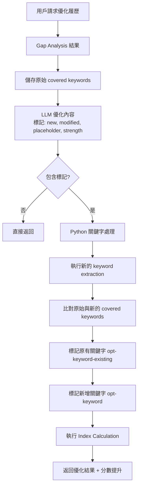

# 履歷關鍵字標記功能優化規格書

**版本**: 1.1.0  
**日期**: 2025-01-11  
**作者**: Claude  
**狀態**: 已確認  
**Demo**: [查看視覺化範例](../demo/resume_marking_demo.html)

## 1. 背景與問題

### 1.1 現況問題
- **LLM 標記不穩定**：經常遺漏重要關鍵字（如 Tableau、Power BI、Superset）
- **錯誤標記整個元素**：LLM 有時會錯誤地將整個 `<li>` 或 `<p>` 標記為 `opt-keyword`，而非特定關鍵字
- **無法區分關鍵字類型**：無法區分「新增關鍵字」與「原有關鍵字」
- **技能列表處理不佳**：技能區域的逗號分隔列表經常整行被標記

### 1.2 根本原因
- LLM 的輸出不穩定，即使有明確指示也可能遺漏
- Prompt engineering 無法 100% 保證標記準確性
- LLM 對 HTML 結構的理解有限

### 1.3 解決方案
將**關鍵字標記邏輯**從 LLM 移至 Python API 層，實現精確控制。LLM 仍負責內容相關的標記。

## 2. 功能規格

### 2.1 核心功能變更

#### 2.1.1 LLM 職責
- **保留功能**：
  - 內容優化（改寫、增強表達）
  - 新增內容（標記 `opt-new`）
  - 佔位符插入（標記 `opt-placeholder`）
  - 優勢標記（`opt-strength`）
  - 修改內容標記（`opt-modified`）
  
- **移除功能**：
  - 關鍵字標記（`opt-keyword`、`opt-keyword-existing`）- 移至 Python

#### 2.1.2 Python 端職責
- 比對優化前後的 covered keywords
- 識別新增的關鍵字（標記為 `opt-keyword`）
- 識別原有的關鍵字（標記為 `opt-keyword-existing`）
- 在 HTML 中精確標記關鍵字
- 處理特殊情況（如技能列表）
- 執行 Index Calculation 以提供優化前後對比

### 2.2 標記類型定義

| 標記類型 | CSS Class | 用途 | 負責方 | 視覺樣式 |
|---------|-----------|------|--------|----------|
| 新增關鍵字 | `opt-keyword` | LLM 優化後新增的關鍵字 | Python | 深藍色背景 (#2563EB) + 白色文字 |
| 原有關鍵字 | `opt-keyword-existing` | 原履歷已有的關鍵字 | Python | 透明背景 + 紫色邊框 |
| 核心優勢 | `opt-strength` | Gap analysis 識別的優勢 | LLM | 綠色背景 (#D1FAE5) |
| 佔位符 | `opt-placeholder` | 需用戶填寫的內容 | LLM | 紅色虛線框 |
| 新增內容 | `opt-new` | LLM 新增的段落或標題 | LLM | 綠色左邊框 |
| 修改內容 | `opt-modified` | LLM 改寫的內容 | LLM | 淡黃色背景 |
| 已編輯 | `opt-improvement` | 用戶已填寫的佔位符 | JavaScript | 綠色底線 |

### 2.3 視覺化範例

完整的視覺化展示請查看：[resume_marking_demo.html](../demo/resume_marking_demo.html)

以下是標記效果的實際範例：

```html
<!-- 新增的 Summary (opt-new) -->
<h2 class="opt-new">Professional Summary</h2>
<p class="opt-new">
    Data Analyst with <span class="opt-placeholder">[YEARS]</span> years of experience in 
    <span class="opt-strength">transforming complex data into actionable business insights</span>. 
    Proven expertise in <span class="opt-keyword">Python</span>, <span class="opt-keyword-existing">SQL</span>, 
    and <span class="opt-keyword">Tableau</span>.
</p>

<!-- 改寫的工作經驗 (opt-modified) -->
<li class="opt-modified">
    <span class="opt-strength">Spearheaded comprehensive data analysis initiatives</span> using 
    <span class="opt-keyword-existing">Python</span> and <span class="opt-keyword">Pandas</span>, 
    processing <span class="opt-placeholder">[NUMBER]</span>+ GB of data daily
</li>
```


### 2.4 標記規則

#### 2.4.1 基本規則
1. **元素限制**
   - `<span>` only: `opt-keyword`, `opt-keyword-existing`, `opt-strength`, `opt-placeholder`, `opt-improvement`
   - Block elements: `opt-new` only

2. **優先級處理**
   ```
   長關鍵字 > 短關鍵字（避免 "Java" 影響 "JavaScript"）
   精確匹配 > 部分匹配
   技術術語 > 一般詞彙
   ```

3. **重疊處理**
   - 已標記的文字不再標記
   - 重疊關鍵字選擇最長匹配

#### 2.3.2 特殊區域處理

**技能區域（Skills Section）**
```html
<!-- 輸入 -->
<h3>Skills</h3>
<ul>
  <li>Programming Languages: Python, Java, JavaScript, TypeScript</li>
  <li>Data Visualization: Tableau, Power BI, Superset</li>
  <li>Databases: MySQL, PostgreSQL, MongoDB</li>
</ul>

<!-- 處理後（假設 Python, JavaScript, Tableau, Power BI 是缺失關鍵字）-->
<h3>Skills</h3>
<ul>
  <li>Programming Languages: <span class="opt-keyword">Python</span>, Java, <span class="opt-keyword">JavaScript</span>, TypeScript</li>
  <li>Data Visualization: <span class="opt-keyword">Tableau</span>, <span class="opt-keyword">Power BI</span>, Superset</li>
  <li>Databases: MySQL, PostgreSQL, MongoDB</li>
</ul>
```

**工作經驗區域**
```html
<!-- 輸入 -->
<li>Developed data pipelines using Python and Apache Airflow for ETL processes</li>

<!-- 處理後（假設 Python 和 Apache Airflow 是關鍵字）-->
<li>Developed data pipelines using <span class="opt-keyword">Python</span> and <span class="opt-keyword">Apache Airflow</span> for ETL processes</li>
```

### 2.5 LLM Prompt 更新

#### 2.5.1 標記指示（加入 v1.0.0.yaml）

```yaml
## 你需要使用的標記類型

### 1. 新增內容 (opt-new)
- 用於：創建全新的段落或區段（原履歷完全沒有的內容）
- 常見：新增 Summary section
- 範例：
  ```html
  <h2 class="opt-new">Professional Summary</h2>
  <p class="opt-new">Data scientist with 10+ years experience...</p>
  ```

### 2. 修改內容 (opt-modified)
- 用於：改寫優化原有內容
- 原則：只要修改了原文就標記（除了拼寫/語法錯誤）
- 範例：
  ```html
  <!-- 原：Responsible for data analysis -->
  <li class="opt-modified">Spearheaded data analysis initiatives...</li>
  ```

### 3. 佔位符 (opt-placeholder)
- 用於：需要具體數據但原文沒有提供
- 範例：
  ```html
  managed <span class="opt-placeholder">[TEAM SIZE]</span> engineers
  ```

### 4. 核心優勢 (opt-strength)
- 用於：強調與職位高度相關的優勢
- 範例：
  ```html
  <span class="opt-strength">led cross-functional teams</span>
  ```

重要：
- 不要標記關鍵字（opt-keyword），Python 會自動處理
- 標記可以巢狀使用（如 opt-modified 內包含 opt-placeholder）
```

### 2.6 實作流程



## 3. 技術實作細節

### 3.1 檔案修改清單

| 檔案路徑 | 修改類型 | 修改內容 |
|---------|---------|---------|
| `src/prompts/resume_tailoring/v1.0.0.yaml` | 修改 | 移除關鍵字標記相關指示 |
| `src/core/enhanced_marker.py` | 新增 | 增強版標記處理器 |
| `src/services/resume_tailoring.py` | 修改 | 整合新標記邏輯 |
| `src/models/api/resume_tailoring.py` | 修改 | 新增參數 |
| `tests/unit/test_enhanced_marker.py` | 新增 | 單元測試 |

### 3.2 API 介面調整

#### 3.2.1 請求參數
```python
class ResumeTailoringRequest(BaseModel):
    job_description: str
    original_resume: str
    gap_analysis: GapAnalysisInput
    language: str = "en"
    include_markers: bool = True
    
    # 新增參數
    mark_existing_keywords: bool = False  # 是否標記已有關鍵字
    mark_strengths: bool = True          # 是否標記優勢
```

#### 3.2.2 回應格式（不變）
```python
class TailoringResult(BaseModel):
    optimized_resume: str
    applied_improvements: List[str]
    optimization_stats: OptimizationStats
    visual_markers: VisualMarkerStats
```

### 3.3 關鍵字匹配演算法

```python
def match_keywords(text: str, keywords: List[str]) -> List[Tuple[int, int, str]]:
    """
    匹配關鍵字並返回位置
    
    Returns:
        List of (start, end, keyword) tuples
    """
    # 1. 預處理關鍵字（按長度降序排序）
    sorted_keywords = sorted(keywords, key=len, reverse=True)
    
    # 2. 編譯正則表達式（支援 word boundary）
    patterns = []
    for keyword in sorted_keywords:
        # 特殊處理包含特殊字符的關鍵字
        if any(char in keyword for char in ['+', '#', '.', '-']):
            # C++, C#, Node.js, etc.
            pattern = re.escape(keyword)
        else:
            # 一般關鍵字使用 word boundary
            pattern = r'\b' + re.escape(keyword) + r'\b'
        patterns.append((pattern, keyword))
    
    # 3. 執行匹配
    matches = []
    for pattern, keyword in patterns:
        for match in re.finditer(pattern, text, re.IGNORECASE):
            matches.append((match.start(), match.end(), keyword))
    
    # 4. 移除重疊匹配
    return remove_overlapping_matches(matches)
```

### 3.4 特殊情況處理

#### 3.4.1 技術術語保護
```python
PROTECTED_TERMS = {
    'JavaScript': ['javascript', 'Javascript'],
    'TypeScript': ['typescript', 'Typescript'],
    'PowerShell': ['powershell', 'Powershell'],
    'GitHub': ['github', 'Github'],
    'GitLab': ['gitlab', 'Gitlab'],
    'PostgreSQL': ['postgresql', 'Postgresql'],
    'MongoDB': ['mongodb', 'Mongodb'],
    # ... 更多
}
```

#### 3.4.2 複合詞處理
```python
COMPOUND_KEYWORDS = [
    'Apache Airflow',
    'Apache Spark',
    'Power BI',
    'Google Cloud Platform',
    'Amazon Web Services',
    'Machine Learning',
    'Deep Learning',
    'Natural Language Processing',
    # ... 更多
]
```

## 4. 測試計畫

### 4.1 單元測試案例

#### Test Case 1: 基本關鍵字標記
```python
def test_basic_keyword_marking():
    html = "<p>Experience with Python and Java development</p>"
    keywords = ["Python", "Java"]
    expected = '<p>Experience with <span class="opt-keyword">Python</span> and <span class="opt-keyword">Java</span> development</p>'
    assert mark_keywords(html, keywords) == expected
```

#### Test Case 2: 重疊關鍵字處理
```python
def test_overlapping_keywords():
    html = "<p>JavaScript and Java developer</p>"
    keywords = ["JavaScript", "Java"]
    # JavaScript 應該優先，第二個 Java 不應被標記
    expected = '<p><span class="opt-keyword">JavaScript</span> and Java developer</p>'
    assert mark_keywords(html, keywords) == expected
```

#### Test Case 3: 技能列表處理
```python
def test_skills_list():
    html = "<li>Databases: MySQL, PostgreSQL, MongoDB</li>"
    keywords = ["MySQL", "PostgreSQL"]
    expected = '<li>Databases: <span class="opt-keyword">MySQL</span>, <span class="opt-keyword">PostgreSQL</span>, MongoDB</li>'
    assert mark_keywords(html, keywords) == expected
```

#### Test Case 4: 大小寫處理
```python
def test_case_handling():
    html = "<p>python and PYTHON and Python</p>"
    keywords = ["Python"]
    # 所有變體都應被標記，但保留原始大小寫
    expected = '<p><span class="opt-keyword">python</span> and <span class="opt-keyword">PYTHON</span> and <span class="opt-keyword">Python</span></p>'
    assert mark_keywords(html, keywords) == expected
```

### 4.2 整合測試

1. **完整履歷測試**：使用真實履歷樣本測試完整流程
2. **效能測試**：確保大型履歷（>10頁）處理時間 < 500ms
3. **準確性測試**：確保 100% 關鍵字標記率

### 4.3 驗收標準

- [ ] 所有單元測試通過
- [ ] 關鍵字標記準確率 100%
- [ ] 無錯誤標記整行/整段的情況
- [ ] 技能區域正確處理
- [ ] 效能符合要求

## 5. 效能與擴展性

### 5.1 效能要求
- 標記處理時間：< 200ms（一般履歷）
- 記憶體使用：< 50MB
- 支援履歷大小：最多 20 頁

### 5.2 效能優化策略
1. 預編譯正則表達式並快取
2. 使用 BeautifulSoup 的 SoupStrainer 只解析需要的部分
3. 批次處理相似關鍵字

### 5.3 未來擴展
1. **關鍵字分類**
   - 技術技能：`opt-keyword-technical`
   - 軟技能：`opt-keyword-soft`
   - 認證：`opt-keyword-certification`

2. **智能同義詞識別**
   - "ML" → "Machine Learning"
   - "K8s" → "Kubernetes"

3. **多語言支援**
   - 中文關鍵字標記
   - 混合語言處理

## 6. 風險與緩解

| 風險 | 影響 | 緩解措施 |
|-----|------|---------|
| 關鍵字列表過長影響效能 | 處理時間增加 | 實施關鍵字數量上限(100個) |
| HTML 結構被破壞 | 顯示異常 | 使用 BeautifulSoup 確保結構完整性 |
| 特殊字符關鍵字 | 匹配失敗 | 特殊處理 regex 轉義 |

## 7. 實施計畫

### Phase 1: 基礎實作（2天）
- [ ] 建立 `enhanced_marker.py`
- [ ] 實作基本關鍵字標記
- [ ] 單元測試

### Phase 2: 整合（1天）
- [ ] 修改 prompt 移除標記指示
- [ ] 整合到 `resume_tailoring.py`
- [ ] 整合測試

### Phase 3: 優化（1天）
- [ ] 效能優化
- [ ] 特殊情況處理
- [ ] 完整測試

## 8. 視覺效果展示

### 8.1 標記前後對比


關鍵視覺差異：
- **新增關鍵字**：深藍色背景 + 白字，非常醒目
- **原有關鍵字**：紫色邊框，低調但可識別
- **修改內容**：淡黃色背景，表示被優化
- **新增內容**：綠色左邊框，清楚標示

### 8.2 用戶價值
1. **一目了然**：哪些關鍵字是新增的（深藍色）
2. **追蹤優化**：哪些內容被改寫（淡黃背景）
3. **互動編輯**：點擊紅色佔位符即可填入數據
4. **分數提升**：顯示優化前後的匹配度變化

## 9. 成功指標

1. **準確性**：關鍵字標記準確率 100%
2. **穩定性**：不依賴 LLM 的不確定輸出
3. **效能**：處理時間 < 200ms
4. **使用者體驗**：清晰區分新增/既有關鍵字

---

**請審核以上規格，並提供您的意見和修改建議。**